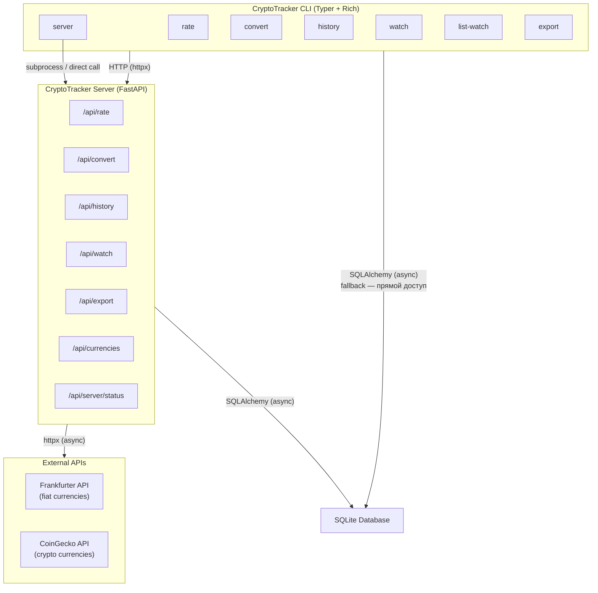
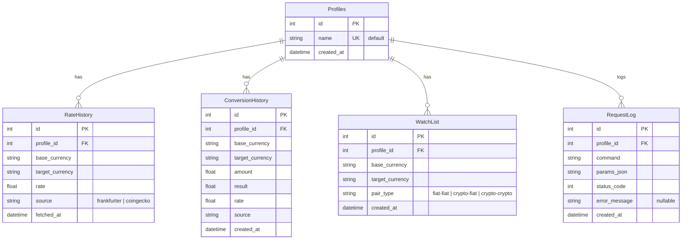
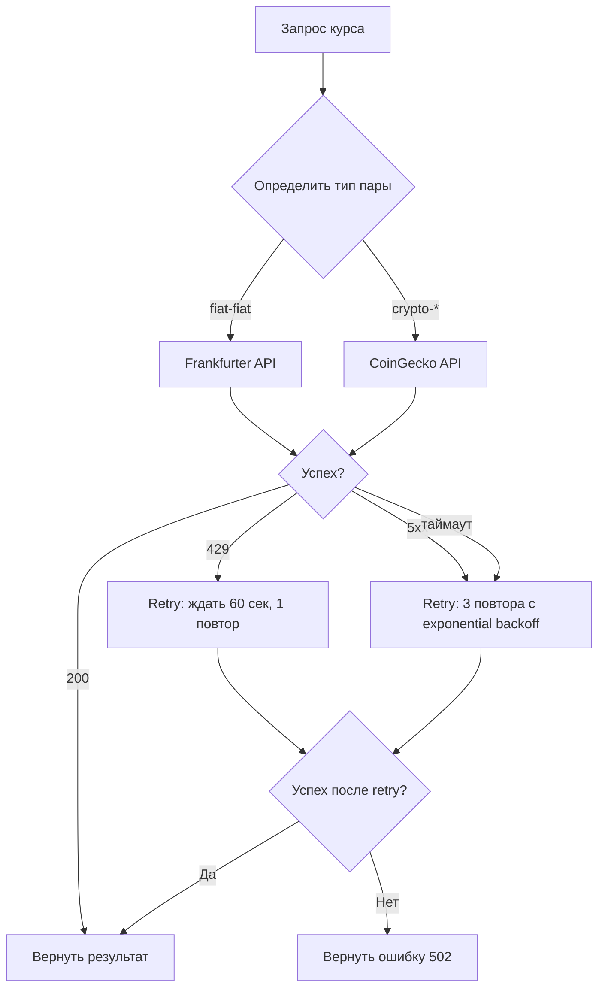
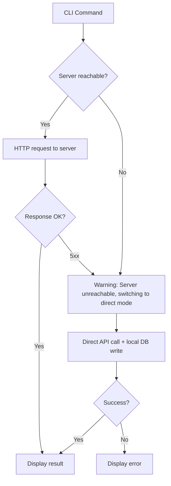

# Техническое задание: CryptoTracker CLI

**Версия**: 1.0  
**Дата**: 2026-05-26  
**Язык**: Python 3.11+  
**Лицензия**: MIT

---

## Оглавление

1. [Общее описание](#1-общее-описание)
2. [Стек технологий и зависимости](#2-стек-технологий-и-зависимости)
3. [Архитектура системы](#3-архитектура-системы)
4. [Структура файлов проекта](#4-структура-файлов-проекта)
5. [База данных](#5-база-данных)
6. [API эндпоинты FastAPI-сервера](#6-api-эндпоинты-fastapi-сервера)
7. [Внешние API](#7-внешние-api)
8. [CLI-команды](#8-cli-команды)
9. [Форматирование вывода Rich](#9-форматирование-вывода-rich)
10. [Обработка ошибок](#10-обработка-ошибок)
11. [Конфигурация](#11-конфигурация)
12. [Сценарии развёртывания и запуска](#12-сценарии-развёртывания-и-запуска)

---

## 1. Общее описание

**CryptoTracker** — консольное CLI-приложение для отслеживания курсов фиатных и криптовалют, конвертации сумм между валютами, ведения списков отслеживания и экспорта данных. Приложение состоит из двух компонентов:

| Компонент | Назначение | Технология |
|-----------|-----------|------------|
| **CLI-клиент** | Интерфейс командной строки для конечного пользователя | Typer + Rich |
| **Backend-сервер** | REST API сервер, проксирует внешние API, хранит историю и настройки | FastAPI + SQLAlchemy + SQLite |

### Ключевые принципы

- **Zero-config для внешних API**: Frankfurter и CoinGecko используются без API-ключей. Приложение не требует регистрации на сторонних сервисах.
- **Локальное хранилище**: Все данные пользователя (история, watchlist) хранятся в локальной SQLite-базе.
- **CLI-first**: Каждая операция доступна как команда CLI. Серверная часть обслуживает CLI-клиент и может быть запущена независимо.
- **Rich-визуализация**: Цветные таблицы, прогресс-бары при ожидании ответа от внешних API, структурированное логирование.

---

## 2. Стек технологий и зависимости

| Пакет | Версия | Назначение |
|-------|--------|------------|
| `typer` | ≥ 0.12 | CLI-фреймворк |
| `rich` | ≥ 13.0 | Цветные таблицы, прогресс-бары, логи |
| `httpx` | ≥ 0.27 | Асинхронный HTTP-клиент для запросов к внешним API и к собственному серверу |
| `fastapi` | ≥ 0.111 | REST-сервер |
| `uvicorn` | ≥ 0.30 | ASGI-сервер для запуска FastAPI |
| `sqlalchemy` | ≥ 2.0 | ORM |
| `aiosqlite` | ≥ 0.20 | Асинхронный драйвер SQLite |
| `pydantic` | ≥ 2.0 | Валидация данных (встроена в FastAPI) |
| `python-dotenv` | ≥ 1.0 | Загрузка конфигурации из `.env` |

Все пакеты — свободные, с открытым исходным кодом.

---

## 3. Архитектура системы



### Режимы работы CLI

CLI может работать в двух режимах:

1. **Client-Server режим** (основной): CLI-клиент отправляет HTTP-запросы к локальному FastAPI-серверу. Сервер проксирует внешние API и пишет историю в БД. Используется, когда сервер запущен командой [`server`](#84-server).

2. **Direct-режим** (fallback): Если сервер недоступен, CLI обращается к внешним API напрямую и пишет историю в локальную БД через прямое подключение SQLAlchemy. Это гарантирует работу CLI даже без запущенного сервера.

---

## 4. Структура файлов проекта

```
cryptotracker/
├── pyproject.toml                    # PEP 621: метаданные, зависимости, скрипты
├── README.md                         # Документация для пользователя
├── tz.md                             # Настоящее ТЗ
├── .env.example                      # Пример файла конфигурации
├── .gitignore
│
├── cryptotracker/                    # Корневой пакет Python
│   ├── __init__.py
│   ├── main.py                       # Точка входа CLI (Typer app)
│   ├── config.py                     # Настройки (путь БД, порт сервера, url)
│   │
│   ├── cli/                          # CLI-слой
│   │   ├── __init__.py
│   │   ├── commands.py               # Реализация всех 7 команд
│   │   ├── formatting.py             # Rich-утилиты: таблицы, прогресс-бары, панели
│   │   └── errors.py                 # Обработчики ошибок CLI (дружелюбные сообщения)
│   │
│   ├── server/                       # Backend-слой
│   │   ├── __init__.py
│   │   ├── app.py                    # Создание FastAPI приложения, lifespan, CORS
│   │   ├── database.py              # AsyncEngine, AsyncSession, get_db dependency
│   │   ├── models.py                # SQLAlchemy ORM models
│   │   ├── schemas.py               # Pydantic models (request/response)
│   │   │
│   │   └── routers/                  # Роутеры FastAPI
│   │       ├── __init__.py
│   │       ├── rates.py              # /api/rate, /api/convert
│   │       ├── watchlist.py          # /api/watch (CRUD)
│   │       ├── history.py            # /api/history
│   │       ├── export.py             # /api/export
│   │       ├── currencies.py         # /api/currencies, /api/crypto
│   │       └── server_status.py      # /api/server/status
│   │
│   └── api/                          # Клиенты внешних API
│       ├── __init__.py
│       ├── client.py                 # Базовый httpx.AsyncClient с retry/timeout
│       ├── frankfurter.py            # Методы Frankfurter API
│       └── coingecko.py              # Методы CoinGecko API
│
├── data/                             # Создаётся при первом запуске (в .gitignore)
│   └── cryptotracker.db              # Файл SQLite базы данных
│
└── tests/                            # Тесты (закладываем структуру)
    ├── __init__.py
    ├── test_commands.py
    ├── test_server.py
    ├── test_models.py
    └── test_external_api.py
```

### `pyproject.toml` — секция скриптов

```toml
[project.scripts]
cryptotracker = "cryptotracker.main:app"
```

После установки пакета (`pip install .`) становится доступна команда `cryptotracker`.

---

## 5. База данных

### 5.1 СУБД

- **Движок**: SQLite 3
- **Драйвер**: `aiosqlite` (асинхронный доступ)
- **Файл**: `data/cryptotracker.db` (создаётся автоматически при первом запуске)
- **Миграции**: Alembic (структура закладывается, автогенерация на основе моделей)

### 5.2 ER-диаграмма



### 5.3 SQLAlchemy модели

#### `Profiles`

| Колонка | Тип | Ограничения | Описание |
|---------|-----|------------|----------|
| `id` | `Integer` | PK, autoincrement | Уникальный идентификатор профиля |
| `name` | `String(50)` | UNIQUE, NOT NULL, индекс | Имя профиля. По умолчанию `"default"` |
| `created_at` | `DateTime` | NOT NULL, default=utcnow | Дата создания профиля |

#### `RateHistory`

| Колонка | Тип | Ограничения | Описание |
|---------|-----|------------|----------|
| `id` | `Integer` | PK, autoincrement | Уникальный идентификатор записи |
| `profile_id` | `Integer` | FK → profiles.id, NOT NULL, индекс | Ссылка на профиль |
| `base_currency` | `String(20)` | NOT NULL, индекс | Базовая валюта (напр., `"btc"`, `"usd"`) |
| `target_currency` | `String(20)` | NOT NULL | Целевая валюта (напр., `"eur"`, `"rub"`) |
| `rate` | `Float` | NOT NULL | Курс: 1 base = X target |
| `source` | `String(20)` | NOT NULL | Источник: `"frankfurter"` или `"coingecko"` |
| `fetched_at` | `DateTime` | NOT NULL, default=utcnow | Временная метка получения курса |

Составной индекс: `(base_currency, target_currency, fetched_at)` для быстрого поиска исторических курсов конкретной пары.

#### `ConversionHistory`

| Колонка | Тип | Ограничения | Описание |
|---------|-----|------------|----------|
| `id` | `Integer` | PK, autoincrement | — |
| `profile_id` | `Integer` | FK → profiles.id, NOT NULL, индекс | — |
| `base_currency` | `String(20)` | NOT NULL | Исходная валюта |
| `target_currency` | `String(20)` | NOT NULL | Целевая валюта |
| `amount` | `Float` | NOT NULL | Сумма в исходной валюте |
| `result` | `Float` | NOT NULL | Результат конвертации |
| `rate` | `Float` | NOT NULL | Курс, использованный при конвертации |
| `source` | `String(20)` | NOT NULL | Источник курса |
| `created_at` | `DateTime` | NOT NULL, default=utcnow | Время конвертации |

#### `WatchList`

| Колонка | Тип | Ограничения | Описание |
|---------|-----|------------|----------|
| `id` | `Integer` | PK, autoincrement | — |
| `profile_id` | `Integer` | FK → profiles.id, NOT NULL, индекс | — |
| `base_currency` | `String(20)` | NOT NULL | Базовая валюта пары отслеживания |
| `target_currency` | `String(20)` | NOT NULL | Целевая валюта пары отслеживания |
| `pair_type` | `String(20)` | NOT NULL | `"fiat-fiat"`, `"crypto-fiat"`, `"crypto-crypto"` |
| `created_at` | `DateTime` | NOT NULL, default=utcnow | Дата добавления в список |

Уникальное ограничение: `UNIQUE(profile_id, base_currency, target_currency)` — нельзя добавить одну и ту же пару дважды.

#### `RequestLog`

| Колонка | Тип | Ограничения | Описание |
|---------|-----|------------|----------|
| `id` | `Integer` | PK, autoincrement | — |
| `profile_id` | `Integer` | FK → profiles.id, NOT NULL, индекс | — |
| `command` | `String(30)` | NOT NULL | Имя команды (`"rate"`, `"convert"`, …) |
| `params_json` | `Text` | NOT NULL | Параметры команды в JSON |
| `status_code` | `Integer` | NOT NULL | HTTP-статус ответа внешнего API (или 0 при локальной ошибке) |
| `error_message` | `Text` | NULLABLE | Текст ошибки, если запрос не удался |
| `created_at` | `DateTime` | NOT NULL, default=utcnow | Время выполнения команды |

---

## 6. API эндпоинты FastAPI-сервера

Базовый URL: `http://localhost:{PORT}/api`  
Порт по умолчанию: `8420` (настраивается через `.env`).

### 6.1 Общие принципы

- Все ответы — JSON с заголовком `Content-Type: application/json`.
- Все эндпоинты принимают query-параметр `profile` (по умолчанию `"default"`), который определяет, от имени какого профиля выполняется запрос.
- При первом обращении профиль создаётся автоматически (если не существует).
- Каждый запрос логируется в таблицу `RequestLog`.

### 6.2 Спецификация эндпоинтов

---

#### `GET /api/server/status`

Проверка работоспособности сервера.

**Ответ `200 OK`**:
```json
{
  "status": "ok",
  "version": "1.0.0",
  "uptime_seconds": 3600,
  "external_apis": {
    "frankfurter": "reachable",
    "coingecko": "reachable"
  }
}
```

`external_apis.*` принимает значения `"reachable"`, `"unreachable"`, `"rate_limited"`.

---

#### `GET /api/currencies`

Список доступных фиатных валют.

**Query-параметры**: `profile` (str, default=`"default"`)

**Ответ `200 OK`**:
```json
{
  "source": "frankfurter",
  "currencies": {
    "AUD": "Australian Dollar",
    "EUR": "Euro",
    "RUB": "Russian Ruble",
    "USD": "United States Dollar"
  },
  "count": 32
}
```

**Логика**: Проксирует [`GET https://api.frankfurter.app/currencies`](https://api.frankfurter.app/currencies). Результат кэшируется в памяти сервера на 1 час (время жизни процесса сервера).

---

#### `GET /api/crypto`

Список доступных криптовалют (топ-250 по market cap).

**Query-параметры**: `profile` (str, default=`"default"`)

**Ответ `200 OK`**:
```json
{
  "source": "coingecko",
  "cryptocurrencies": [
    {"id": "bitcoin", "symbol": "btc", "name": "Bitcoin"},
    {"id": "ethereum", "symbol": "eth", "name": "Ethereum"}
  ],
  "count": 250
}
```

**Логика**: Проксирует [`GET https://api.coingecko.com/api/v3/coins/list`](https://api.coingecko.com/api/v3/coins/list). Кэшируется в памяти сервера на 24 часа.

---

#### `GET /api/rate`

Получить текущий курс между двумя валютами.

**Query-параметры**:

| Параметр | Тип | Обязательный | Описание |
|----------|-----|-------------|----------|
| `profile` | str | Нет | Имя профиля (default: `"default"`) |
| `base` | str | Да | Код базовой валюты (нижний регистр) |
| `target` | str | Да | Код целевой валюты (нижний регистр) |

**Ответ `200 OK`**:
```json
{
  "base": "btc",
  "target": "usd",
  "rate": 68450.12,
  "source": "coingecko",
  "fetched_at": "2026-05-26T10:30:00Z"
}
```

**Логика**:
1. Определить тип пары:
   - Обе валюты — фиат → Frankfurter.
   - Хотя бы одна — крипто → CoinGecko.
2. Выполнить запрос к внешнему API.
3. Сохранить результат в `RateHistory`.
4. Записать лог в `RequestLog`.
5. Вернуть ответ клиенту.

**Ошибки**:
- `400` — неверный код валюты.
- `502` — внешнее API недоступно.
- `404` — валюта не найдена.

---

#### `POST /api/convert`

Конвертировать сумму из одной валюты в другую.

**Тело запроса**:
```json
{
  "base": "btc",
  "target": "rub",
  "amount": 0.5
}
```

**Query-параметры**: `profile` (str, default=`"default"`)

**Ответ `200 OK`**:
```json
{
  "base": "btc",
  "target": "rub",
  "amount": 0.5,
  "result": 3422506.00,
  "rate": 6845012.00,
  "source": "coingecko",
  "converted_at": "2026-05-26T10:30:00Z"
}
```

**Логика**:
1. Запросить курс через ту же логику, что и `/api/rate`.
2. Умножить `amount` на `rate`.
3. Сохранить запись в `ConversionHistory`.
4. Записать лог в `RequestLog`.

**Ошибки**: Аналогично `/api/rate`, плюс `422` — невалидный JSON.

---

#### `GET /api/history`

Получить историю запросов профиля.

**Query-параметры**:

| Параметр | Тип | Обязательный | Описание |
|----------|-----|-------------|----------|
| `profile` | str | Нет | Имя профиля (default: `"default"`) |
| `limit` | int | Нет | Количество записей (default: 20, max: 100) |
| `offset` | int | Нет | Смещение для пагинации (default: 0) |
| `command` | str | Нет | Фильтр по имени команды (`"rate"`, `"convert"`, …) |

**Ответ `200 OK`**:
```json
{
  "profile": "default",
  "total": 42,
  "limit": 20,
  "offset": 0,
  "items": [
    {
      "id": 1,
      "command": "rate",
      "params_json": "{\"base\": \"btc\", \"target\": \"usd\"}",
      "status_code": 200,
      "error_message": null,
      "created_at": "2026-05-26T10:30:00Z"
    }
  ]
}
```

**Источник данных**: Таблица `RequestLog`.

---

#### `POST /api/watch`

Добавить валютную пару в список отслеживания.

**Тело запроса**:
```json
{
  "base": "eth",
  "target": "usd"
}
```

**Query-параметры**: `profile` (str, default=`"default"`)

**Ответ `201 Created`**:
```json
{
  "id": 5,
  "base": "eth",
  "target": "usd",
  "pair_type": "crypto-fiat",
  "created_at": "2026-05-26T10:30:00Z"
}
```

**Логика**:
1. Определить `pair_type` (поиск валют среди фиатных и крипто-списков).
2. Проверить уникальность: пара `(profile_id, base, target)` не должна существовать.
3. Сохранить в `WatchList`.

**Ошибки**:
- `409` — такая пара уже отслеживается.
- `400` — неизвестный код валюты.

---

#### `GET /api/watch`

Получить список отслеживаемых пар с текущими курсами.

**Query-параметры**: `profile` (str, default=`"default"`)

**Ответ `200 OK`**:
```json
{
  "profile": "default",
  "pairs": [
    {
      "id": 1,
      "base": "btc",
      "target": "usd",
      "pair_type": "crypto-fiat",
      "current_rate": 68450.12,
      "rate_source": "coingecko",
      "added_at": "2026-05-20T08:00:00Z"
    }
  ],
  "count": 3
}
```

**Логика**:
1. Извлечь все пары из `WatchList` для профиля.
2. Для каждой пары получить текущий курс (асинхронно, параллельно).
3. Если внешнее API недоступно для какой-то пары, вернуть `"current_rate": null` и `"rate_source": "unavailable"`.

---

#### `DELETE /api/watch/{id}`

Удалить валютную пару из списка отслеживания.

**Path-параметры**: `id` (int) — идентификатор записи в WatchList.

**Query-параметры**: `profile` (str, default=`"default"`)

**Ответ `200 OK`**:
```json
{
  "deleted": true,
  "id": 5
}
```

**Ошибки**:
- `404` — запись не найдена или принадлежит другому профилю.

---

#### `GET /api/export`

Экспортировать данные профиля.

**Query-параметры**:

| Параметр | Тип | Обязательный | Описание |
|----------|-----|-------------|----------|
| `profile` | str | Нет | Имя профиля (default: `"default"`) |
| `format` | str | Нет | `"json"` (default) или `"csv"` |
| `dataset` | str | Нет | `"history"` (default), `"watchlist"`, `"conversions"`, `"all"` |

**Ответ `200 OK`** (при `format=json`):
```json
{
  "profile": "default",
  "dataset": "all",
  "exported_at": "2026-05-26T10:30:00Z",
  "data": {
    "watchlist": [ ... ],
    "history": [ ... ],
    "conversions": [ ... ]
  }
}
```

**Ответ `200 OK`** (при `format=csv`):
```
Content-Type: text/csv
Content-Disposition: attachment; filename="cryptotracker_export.csv"

command,params_json,status_code,error_message,created_at
rate,"{""base"":""btc"",""target"":""usd""}",200,,2026-05-26T10:30:00Z
...
```

**Логика**:
- Для JSON: сериализовать все запрошенные наборы данных.
- Для CSV: сериализовать в плоскую структуру (только RequestLog и ConversionHistory; WatchList опускается в CSV, так как его проще хранить в JSON).

---

## 7. Внешние API

### 7.1 Frankfurter API

| Параметр | Значение |
|----------|---------|
| Базовый URL | `https://api.frankfurter.app` |
| Аутентификация | Не требуется |
| Rate limit | Нет задокументированного лимита (разумная пауза: 1 запрос/сек) |
| Поддерживаемые валюты | ~32 фиатные валюты |

**Используемые эндпоинты**:

| Метод | Путь | Назначение |
|-------|------|-----------|
| `GET` | `/currencies` | Список доступных валют |
| `GET` | `/latest?from={base}&to={target}` | Текущий курс |

**Пример ответа `/latest?from=usd&to=eur,rub`**:
```json
{
  "amount": 1.0,
  "base": "USD",
  "date": "2026-05-26",
  "rates": {
    "EUR": 0.92,
    "RUB": 91.50
  }
}
```

### 7.2 CoinGecko API

| Параметр | Значение |
|----------|---------|
| Базовый URL | `https://api.coingecko.com/api/v3` |
| Аутентификация | Не требуется (free tier) |
| Rate limit | 10–30 запросов/минуту (без ключа) |
| Поддерживаемые валюты | ~15 000+ криптовалют |

**Используемые эндпоинты**:

| Метод | Путь | Назначение |
|-------|------|-----------|
| `GET` | `/coins/list` | Список всех монет (id, symbol, name) |
| `GET` | `/simple/price?ids={id}&vs_currencies={target}` | Текущая цена |

**Пример ответа `/simple/price?ids=bitcoin&vs_currencies=usd,rub`**:
```json
{
  "bitcoin": {
    "usd": 68450,
    "rub": 6270000
  }
}
```

### 7.3 Стратегия взаимодействия с внешними API



**Параметры HTTP-клиента**:
- `timeout` = 15 секунд (connect: 5s, read: 10s)
- `max_retries` = 3
- `backoff_factor` = 1.0 (1s, 2s, 4s)
- `User-Agent`: `CryptoTracker/1.0`

---

## 8. CLI-команды

Все команды вызываются как подкоманды `cryptotracker`:

```
cryptotracker [OPTIONS] COMMAND [ARGS]
```

Глобальные опции:
- `--profile TEXT` — имя профиля (по умолчанию `"default"`)
- `--server-url TEXT` — URL сервера (по умолчанию `http://localhost:8420`)
- `--help` — справка

---

### 8.1 `rate`

Получить текущий курс между двумя валютами.

```
cryptotracker rate [OPTIONS] BASE TARGET
```

**Аргументы**:
- `BASE` — код базовой валюты (например, `btc`, `usd`)
- `TARGET` — код целевой валюты (например, `eur`, `rub`)

**Опции**:
- `--server / --no-server` — использовать сервер или прямой запрос (default: `--server`)

**Пример вызова**:
```bash
cryptotracker rate btc usd
```

**Rich-вывод**:
```
╭──────────────────────────────────────────────╮
│              💱 Current Exchange Rate         │
├──────────────────────────────────────────────┤
│  Pair      │ BTC → USD                       │
│  Rate      │ 1 BTC = 68,450.12 USD           │
│  Source    │ CoinGecko                       │
│  Fetched   │ 2026-05-26 13:30:00 MSK         │
╰──────────────────────────────────────────────╯
```

Цветовая схема: заголовок — `bold cyan` на тёмном фоне, числа — `bold green`, source — `dim`.

---

### 8.2 `convert`

Конвертировать сумму из одной валюты в другую.

```
cryptotracker convert [OPTIONS] BASE TARGET AMOUNT
```

**Аргументы**:
- `BASE`, `TARGET` — аналогично `rate`
- `AMOUNT` — сумма в базовой валюте (float)

**Опции**:
- `--server / --no-server` — (default: `--server`)

**Пример**:
```bash
cryptotracker convert btc rub 0.25
```

**Rich-вывод**:
```
╭──────────────────────────────────────────────────────╮
│              🔄 Currency Conversion                   │
├──────────────────────────────────────────────────────┤
│  From        │ 0.25 BTC                               │
│  To          │ 1,711,253.00 RUB                       │
│  Rate        │ 1 BTC = 6,845,012.00 RUB               │
│  Source      │ CoinGecko                              │
│  Converted   │ 2026-05-26 13:31:00 MSK                │
╰──────────────────────────────────────────────────────╯
```

Числа форматируются с разделителями тысяч и двумя знаками после запятой. Для криптовалют — до 8 знаков.

---

### 8.3 `history`

Показать историю запросов.

```
cryptotracker history [OPTIONS]
```

**Опции**:
- `--limit INTEGER` — количество записей (default: 20)
- `--command TEXT` — фильтр по команде (`rate`, `convert`, `watch`)
- `--server / --no-server` — (default: `--server`)

**Пример**:
```bash
cryptotracker history --limit 10 --command rate
```

**Rich-вывод** (таблица):

```
                       📋 Request History (profile: default)
┏━━━━━━┳━━━━━━━━━━┳━━━━━━━━━━━━━━━━━━━━━━━━━━┳━━━━━━━━┳━━━━━━━━━━━━━━━━━━━━━┓
┃  ID  ┃ Command  ┃ Parameters               ┃ Status ┃ Timestamp           ┃
┡━━━━━━╇━━━━━━━━━━╇━━━━━━━━━━━━━━━━━━━━━━━━━━╇━━━━━━━━╇━━━━━━━━━━━━━━━━━━━━━┩
│   42 │ rate     │ btc → usd                │ ✅ 200 │ 2026-05-26 13:30     │
│   41 │ convert  │ 0.25 btc → rub           │ ✅ 200 │ 2026-05-26 13:31     │
│   40 │ watch    │ add: eth → usd           │ ✅ 201 │ 2026-05-26 12:00     │
│   39 │ rate     │ doge → usd               │ ❌ 404 │ 2026-05-26 11:45     │
└──────┴──────────┴──────────────────────────┴────────┴─────────────────────┘
Showing 4 of 42 total records (limit=10, offset=0)
```

Цвета строк таблицы:
- ✅ Успешные запросы — `green`
- ❌ Ошибочные запросы — `red`
- Строки подсвечиваются через `rich.table.Table` с `row_styles`.

---

### 8.4 `server`

Запустить FastAPI-сервер.

```
cryptotracker server [OPTIONS]
```

**Опции**:
- `--host TEXT` — хост (default: `127.0.0.1`)
- `--port INTEGER` — порт (default: `8420`)
- `--reload` — включить авто-перезагрузку при изменениях кода (dev-режим)

**Пример**:
```bash
cryptotracker server --port 9000 --reload
```

**Rich-вывод** (логи через `rich.logging`):
```
                    🚀 CryptoTracker Server
╭──────────────────────────────────────────────────────────────╮
│  Server    │ http://127.0.0.1:8420                           │
│  API Docs  │ http://127.0.0.1:8420/docs                      │
│  Database  │ data/cryptotracker.db                           │
│  Profile   │ default                                         │
╰──────────────────────────────────────────────────────────────╯
[INFO] Checking external APIs...
[INFO] Frankfurter API: ✅ reachable
[INFO] CoinGecko API:  ✅ reachable
[INFO] Server started successfully.
```

Сервер продолжает работать в foreground. Логи выводятся через `RichHandler`.

---

### 8.5 `watch`

Добавить или удалить валютную пару из списка отслеживания.

```
cryptotracker watch [OPTIONS] BASE TARGET
```

**Аргументы**:
- `BASE`, `TARGET` — коды валют

**Опции**:
- `--remove` — удалить пару вместо добавления
- `--server / --no-server` — (default: `--server`)

**Примеры**:
```bash
cryptotracker watch eth usd
cryptotracker watch eth usd --remove
```

**Rich-вывод** (добавление):
```
╭──────────────────────────────────────────────────────╮
│              👁️  Added to Watchlist                   │
├──────────────────────────────────────────────────────┤
│  Pair       │ ETH → USD                              │
│  Type       │ crypto-fiat                            │
│  Added      │ 2026-05-26 13:32:00 MSK                │
╰──────────────────────────────────────────────────────╯
```

**Rich-вывод** (удаление):
```
╭──────────────────────────────────────────────────────╮
│              🗑️  Removed from Watchlist               │
├──────────────────────────────────────────────────────┤
│  Pair       │ ETH → USD                              │
╰──────────────────────────────────────────────────────╯
```

---

### 8.6 `list-watch`

Показать список отслеживаемых пар с текущими курсами.

```
cryptotracker list-watch [OPTIONS]
```

**Опции**:
- `--server / --no-server` — (default: `--server`)

**Пример**:
```bash
cryptotracker list-watch
```

**Rich-вывод** (таблица с прогресс-баром при загрузке):

```
                    👁️  Watchlist (profile: default)
⏳ Fetching current rates...

┏━━━━━━┳━━━━━━━━━━━━━━━━┳━━━━━━━━━━━━━━━━┳━━━━━━━━━━━━━━━━┳━━━━━━━━━━━━━┳━━━━━━━━━━━━━━━━┓
┃  ID  ┃ Base           ┃ Target         ┃ Rate           ┃ Source      ┃ Added          ┃
┡━━━━━━╇━━━━━━━━━━━━━━━━╇━━━━━━━━━━━━━━━━╇━━━━━━━━━━━━━━━━╇━━━━━━━━━━━━━╇━━━━━━━━━━━━━━━━┩
│    1 │ BTC            │ USD            │ 68,450.12      │ CoinGecko   │ May 20, 2026   │
│    2 │ ETH            │ USD            │  3,421.50      │ CoinGecko   │ May 22, 2026   │
│    3 │ USD            │ RUB            │     91.50      │ Frankfurter │ May 25, 2026   │
└──────┴────────────────┴────────────────┴────────────────┴─────────────┴────────────────┘
```

Прогресс-бар: `rich.progress.Progress` с асинхронным обновлением.

Изменение курса относительно последнего сохранённого значения: зелёная стрелка вверх `▲` / красная стрелка вниз `▼`. Если данных нет — `dim`.

---

### 8.7 `export`

Экспортировать данные профиля в файл.

```
cryptotracker export [OPTIONS]
```

**Опции**:
- `--format TEXT` — `json` или `csv` (default: `json`)
- `--dataset TEXT` — `history`, `watchlist`, `conversions`, `all` (default: `all`)
- `--output PATH` — путь к выходному файлу (default: `./cryptotracker_export.{format}`)
- `--server / --no-server` — (default: `--server`)

**Примеры**:
```bash
cryptotracker export --format csv --dataset history --output history.csv
cryptotracker export --format json --output backup.json
```

**Rich-вывод**:
```
╭──────────────────────────────────────────────────────╮
│              📦 Export Complete                       │
├──────────────────────────────────────────────────────┤
│  Format     │ CSV                                    │
│  Dataset    │ history                                │
│  Records    │ 42                                     │
│  Output     │ C:\Users\...\history.csv                │
│  Size       │ 4.2 KB                                 │
╰──────────────────────────────────────────────────────╯
```

---

## 9. Форматирование вывода Rich

### 9.1 Цветовая палитра

| Элемент | Стиль Rich |
|---------|-----------|
| Заголовки панелей | `bold cyan` |
| Успешные значения, курсы | `bold green` |
| Ошибки | `bold red` |
| Названия валют | `bold yellow` |
| Временные метки | `dim` |
| Источник данных | `italic dim` |
| Прогресс-бар | `green` (успех), `red` (ошибка) |
| Логи INFO | `green` |
| Логи WARNING | `yellow` |
| Логи ERROR | `red` |

### 9.2 Компоненты

- **Панели** (`rich.panel.Panel`): Для изолированных блоков информации (команды `rate`, `convert`, `watch`, `export`, `server`).
- **Таблицы** (`rich.table.Table`): Для списков (`history`, `list-watch`). Использовать `box=box.ROUNDED`, `show_header=True`, `header_style="bold cyan"`.
- **Прогресс-бары** (`rich.progress.Progress`): Для `list-watch` при параллельной загрузке курсов.
- **Логи** (`rich.logging.RichHandler`): Для команды [`server`](#84-server) и отладочного режима.
- **Деревья** (`rich.tree`): Возможное будущее расширение для иерархического отображения портфеля.

### 9.3 Форматирование чисел

```python
# Фиатные валюты: 2 знака после запятой, разделители тысяч
# 68450.12 → "68,450.12"
# 0.025 → "0.03" (округление до 2 знаков)

# Криптовалюты: до 8 знаков после запятой (если сумма < 1)
# 0.00251432 → "0.00251432"
# 1.5 → "1.50"

# Вспомогательная функция в formatting.py:
# format_currency(amount: float, currency: str) -> str
```

---

## 10. Обработка ошибок

### 10.1 Классификация ошибок

| Тип | Код | Описание | Действие |
|-----|-----|---------|----------|
| `ServerUnreachable` | — | FastAPI-сервер не отвечает | Fallback на direct-режим |
| `ExternalAPIUnreachable` | 502 | Frankfurter/CoinGecko недоступны | Retry (3 попытки), затем ошибка |
| `ExternalAPIRateLimited` | 429 | Превышен rate-limit внешнего API | Ждать 60 сек, 1 повтор |
| `CurrencyNotFound` | 404 | Код валюты не найден | Сообщение с подсказкой `--list-currencies` |
| `PairAlreadyTracked` | 409 | Пара уже в watchlist | Предложить `list-watch` |
| `PairNotTracked` | 404 | Попытка удалить неотслеживаемую пару | Сообщение |
| `InvalidAmount` | 422 | Отрицательная сумма | Сообщение |
| `DatabaseError` | 500 | Ошибка SQLite | Логирование, сообщение пользователю |
| `ExportError` | 500 | Ошибка записи файла | Сообщение с путём |

### 10.2 Direct-режим (fallback)



**Реализация**: каждая CLI-команда через `try/except httpx.ConnectError` перехватывает ошибку соединения и переключается на прямой вызов.

### 10.3 Сообщения об ошибках в CLI (Rich)

```
╭──────────────────────────────────────────────────────╮
│              ❌ Error: Currency Not Found              │
├──────────────────────────────────────────────────────┤
│  Currency  │ XXXX                                    │
│  Message   │ The currency code 'XXXX' was not found  │
│            │ in Frankfurter or CoinGecko.            │
│  Hint      │ Run: cryptotracker currencies           │
│            │ to see all available currencies.        │
╰──────────────────────────────────────────────────────╯
```

### 10.4 Логирование ошибок на сервере

- Все ошибки пишутся в `RequestLog` с `status_code` и `error_message`.
- Сервер использует `logging` с `RichHandler` для структурированного вывода.
- Необработанные исключения перехватываются глобальным exception handler FastAPI.

---

## 11. Конфигурация

Файл `.env` (в корне проекта):

```env
# Server
CRYPTOTRACKER_SERVER_HOST=127.0.0.1
CRYPTOTRACKER_SERVER_PORT=8420

# Database
CRYPTOTRACKER_DB_PATH=data/cryptotracker.db

# External APIs
CRYPTOTRACKER_FRANKFURTER_URL=https://api.frankfurter.app
CRYPTOTRACKER_COINGECKO_URL=https://api.coingecko.com/api/v3

# HTTP Client
CRYPTOTRACKER_REQUEST_TIMEOUT=15
CRYPTOTRACKER_MAX_RETRIES=3

# Logging
CRYPTOTRACKER_LOG_LEVEL=INFO
```

Загрузка через [`config.py`](cryptotracker/config.py) с использованием `python-dotenv` и `pydantic.BaseSettings` (или `pydantic-settings`).

---

## 12. Сценарии развёртывания и запуска

### 12.1 Установка

```bash
# Клонирование репозитория
git clone <repo-url>
cd cryptotracker

# Создание виртуального окружения
python -m venv .venv
source .venv/bin/activate  # или .venv\Scripts\activate на Windows

# Установка
pip install -e .
```

### 12.2 Типичные сценарии использования

**Сценарий 1: Быстрая проверка курса (без сервера)**
```bash
cryptotracker --no-server rate btc usd
```

**Сценарий 2: Запуск сервера и работа через него**
```bash
# Терминал 1: запуск сервера
cryptotracker server --port 8420

# Терминал 2: использование CLI
cryptotracker rate eth usd
cryptotracker convert btc rub 0.5
cryptotracker watch add eth usd
cryptotracker list-watch
cryptotracker history --limit 10
```

**Сценарий 3: Настройка watchlist и экспорт**
```bash
cryptotracker watch btc usd
cryptotracker watch eth usd
cryptotracker watch usd rub
cryptotracker list-watch
cryptotracker export --format csv --output my_portfolio.csv
```

**Сценарий 4: Несколько профилей**
```bash
cryptotracker --profile work rate usd eur
cryptotracker --profile personal rate btc usd
cryptotracker --profile personal history
```

---

## Приложение А: Коды возврата CLI

| Код | Значение |
|-----|---------|
| `0` | Успешное выполнение |
| `1` | Ошибка валидации ввода (неверная валюта, отрицательная сумма) |
| `2` | Сервер недоступен (и direct-режим тоже не смог) |
| `3` | Внешнее API недоступно |
| `4` | Ошибка базы данных |
| `5` | Ошибка экспорта (файл не может быть записан) |

---

## Приложение Б: Формат вывода `cryptotracker --help`

```
 Usage: cryptotracker [OPTIONS] COMMAND [ARGS]...

 💎 CryptoTracker — Cryptocurrency & Fiat Exchange Rate Tracker

╭─ Global Options ───────────────────────────────────────────────╮
│ --profile        TEXT   Profile name [default: default]        │
│ --server-url     TEXT   Server URL [default: http://localhost:8420]│
│ --help                  Show this message and exit.            │
╰────────────────────────────────────────────────────────────────╯

╭─ Commands ────────────────────────────────────────────────────╮
│ server       🚀  Start the CryptoTracker backend server       │
│ rate         💱  Get current exchange rate for a pair         │
│ convert      🔄  Convert an amount between currencies         │
│ history      📋  Show request history                        │
│ watch        👁️  Add/remove pairs to/from watchlist          │
│ list-watch   📊  Show watchlist with current rates           │
│ export       📦  Export data to JSON or CSV                  │
╰──────────────────────────────────────────────────────────────╯
```

---

*Конец технического задания.*
