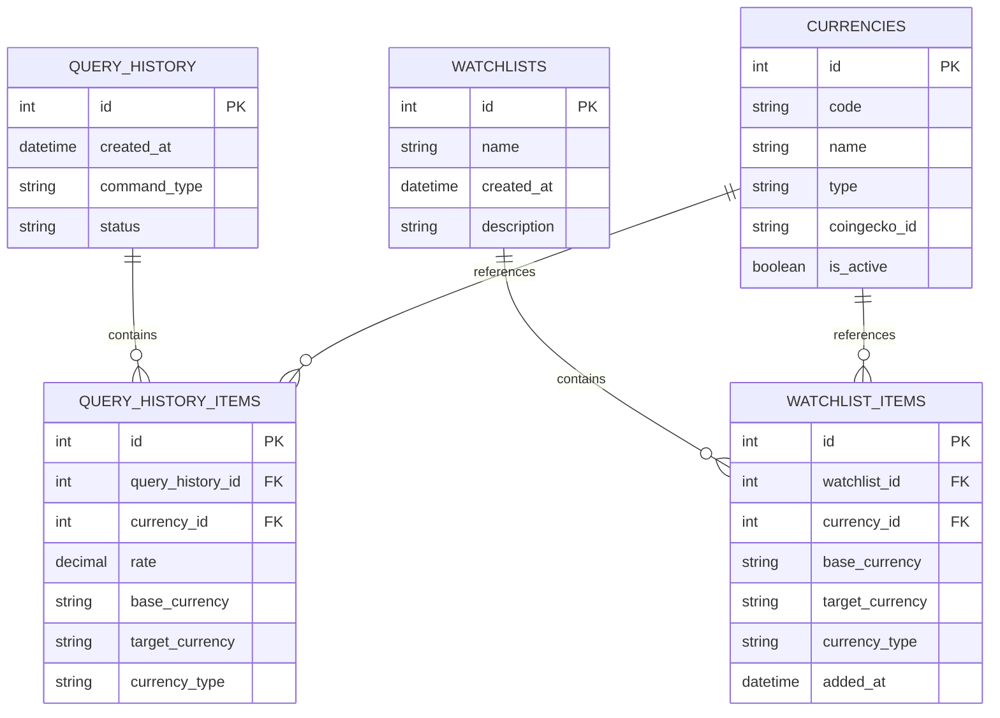

# Техническое задание: CryptoTracker CLI Application

## 1. Обзор проекта

### 1.1 Название
**CryptoTracker** — CLI-приложение для отслеживания курсов криптовалют и фиатных валют с локальным сервером для хранения истории запросов и списков отслеживания.

### 1.2 Цели проекта
- Предоставить удобный CLI-интерфейс для получения актуальных курсов валют
- Интегрировать два внешних API: Frankfurter (фиатные валюты) и CoinGecko (криптовалюты)
- Реализовать локальный FastAPI-сервер для хранения истории запросов и watchlist
- Обеспечить красивую визуализацию данных через Rich (таблицы, прогресс-бары, цветной вывод)
- Поддержать экспорт данных в CSV/JSON форматы

### 1.3 Технологический стек
- **Язык**: Python 3.10+
- **CLI фреймворк**: Typer
- **Визуализация**: Rich
- **Backend**: FastAPI
- **ORM**: SQLAlchemy 2.0+
- **База данных**: SQLite
- **HTTP клиент**: httpx (асинхронный)
- **Валидация**: Pydantic v2
- **Асинхронность**: asyncio, uvicorn

---

## 2. Внешние API

### 2.1 Frankfurter API (фиатные валюты)

**Base URL**: `https://api.frankfurter.app`

**Аутентификация**: Не требуется (без API-ключа)

**Rate Limits**: Рекомендуется не более 1 запроса в секунду

#### 2.1.1 Используемые эндпоинты

##### GET /latest
Получение актуальных курсов валют.

**Query параметры**:
- `from` (опционально): Базовая валюта (по умолчанию EUR)
- `to` (опционально): Целевая валюта или список через запятую

**Пример запроса**:
```
GET https://api.frankfurter.app/latest?from=USD&to=EUR,RUB
```

**Пример ответа**:
```json
{
  "amount": 1.0,
  "base": "USD",
  "date": "2026-05-26",
  "rates": {
    "EUR": 0.9234,
    "RUB": 89.45
  }
}
```

##### GET /currencies
Получение списка всех доступных фиатных валют.

**Пример ответа**:
```json
{
  "AUD": "Australian Dollar",
  "BGN": "Bulgarian Lev",
  "BRL": "Brazilian Real",
  "CAD": "Canadian Dollar",
  "CHF": "Swiss Franc",
  "CNY": "Chinese Renminbi Yuan",
  "CZK": "Czech Koruna",
  "DKK": "Danish Krone",
  "EUR": "Euro",
  "GBP": "Pound Sterling",
  "HKD": "Hong Kong Dollar",
  "HUF": "Hungarian Forint",
  "IDR": "Indonesian Rupiah",
  "ILS": "Israeli New Sheqel",
  "INR": "Indian Rupee",
  "ISK": "Icelandic Króna",
  "JPY": "Japanese Yen",
  "KRW": "South Korean Won",
  "MXN": "Mexican Peso",
  "MYR": "Malaysian Ringgit",
  "NOK": "Norwegian Krone",
  "NZD": "New Zealand Dollar",
  "PHP": "Philippine Peso",
  "PLN": "Polish Złoty",
  "RON": "Romanian Leu",
  "RUB": "Russian Ruble",
  "SEK": "Swedish Krona",
  "SGD": "Singapore Dollar",
  "THB": "Thai Baht",
  "TRY": "Turkish Lira",
  "USD": "United States Dollar",
  "ZAR": "South African Rand"
}
```

##### GET /{date}
Получение исторических курсов на конкретную дату.

**Формат даты**: YYYY-MM-DD

**Пример запроса**:
```
GET https://api.frankfurter.app/2026-01-15?from=USD&to=EUR
```

**Пример ответа**:
```json
{
  "amount": 1.0,
  "base": "USD",
  "date": "2026-01-15",
  "rates": {
    "EUR": 0.9156
  }
}
```

### 2.2 CoinGecko API (криптовалюты)

**Base URL**: `https://api.coingecko.com/api/v3`

**Аутентификация**: Не требуется (бесплатный tier без API-ключа)

**Rate Limits**: 10-30 запросов в минуту для бесплатного tier

#### 2.2.1 Используемые эндпоинты

##### GET /simple/price
Получение актуальных цен криптовалют.

**Query параметры**:
- `ids` (обязательно): ID криптовалюты или список через запятую (например, `bitcoin,ethereum`)
- `vs_currencies` (обязательно): Целевая валюта или список через запятую (например, `usd,eur`)
- `include_24hr_change` (опционально): Включить изменение за 24 часа (true/false)
- `include_last_updated_at` (опционально): Включить timestamp последнего обновления

**Пример запроса**:
```
GET https://api.coingecko.com/api/v3/simple/price?ids=bitcoin,ethereum&vs_currencies=usd,eur&include_24hr_change=true
```

**Пример ответа**:
```json
{
  "bitcoin": {
    "usd": 68432.12,
    "usd_24h_change": 2.34,
    "eur": 63156.78,
    "eur_24h_change": 2.31
  },
  "ethereum": {
    "usd": 3845.67,
    "usd_24h_change": -1.23,
    "eur": 3549.12,
    "eur_24h_change": -1.25
  }
}
```

##### GET /coins/list
Получение списка всех доступных криптовалют с их ID.

**Query параметры**:
- `include_platform` (опционально): Включить информацию о платформах (true/false)

**Пример ответа**:
```json
[
  {
    "id": "bitcoin",
    "symbol": "btc",
    "name": "Bitcoin"
  },
  {
    "id": "ethereum",
    "symbol": "eth",
    "name": "Ethereum"
  },
  {
    "id": "binancecoin",
    "symbol": "bnb",
    "name": "BNB"
  }
]
```

##### GET /coins/{id}
Получение детальной информации о криптовалюте.

**Query параметры**:
- `localization` (опционально): Включить локализацию (true/false, по умолчанию true)
- `tickers` (опционально): Включить тикеры (true/false, по умолчанию true)
- `market_data` (опционально): Включить рыночные данные (true/false, по умолчанию true)
- `community_data` (опционально): Включить данные сообщества (true/false, по умолчанию true)
- `developer_data` (опционально): Включить данные разработчиков (true/false, по умолчанию true)

**Пример запроса**:
```
GET https://api.coingecko.com/api/v3/coins/bitcoin?localization=false&tickers=false&community_data=false&developer_data=false
```

**Пример ответа** (сокращенный):
```json
{
  "id": "bitcoin",
  "symbol": "btc",
  "name": "Bitcoin",
  "market_data": {
    "current_price": {
      "usd": 68432.12,
      "eur": 63156.78
    },
    "market_cap": {
      "usd": 1345678901234
    },
    "total_volume": {
      "usd": 28456789012
    },
    "price_change_percentage_24h": 2.34,
    "price_change_percentage_7d": 5.67,
    "price_change_percentage_30d": 12.34
  }
}
```

---

## 3. Архитектура базы данных

### 3.1 Общая схема

База данных SQLite будет содержать 4 основные таблицы:



### 3.2 Детальное описание таблиц

#### 3.2.1 Таблица: currencies

Хранит справочник всех валют (фиатных и криптовалют).

| Поле | Тип | Ограничения | Описание |
|------|-----|-------------|----------|
| id | INTEGER | PRIMARY KEY, AUTOINCREMENT | Уникальный идентификатор |
| code | VARCHAR(10) | NOT NULL, UNIQUE | Код валюты (USD, EUR, BTC, ETH) |
| name | VARCHAR(100) | NOT NULL | Полное название валюты |
| type | VARCHAR(10) | NOT NULL, CHECK (type IN ('fiat', 'crypto')) | Тип валюты |
| coingecko_id | VARCHAR(50) | NULLABLE | ID в CoinGecko API (только для крипто) |
| is_active | BOOLEAN | DEFAULT TRUE | Флаг активности валюты |
| created_at | DATETIME | DEFAULT CURRENT_TIMESTAMP | Дата создания записи |
| updated_at | DATETIME | DEFAULT CURRENT_TIMESTAMP | Дата последнего обновления |

**Индексы**:
- `idx_currencies_code` на поле `code`
- `idx_currencies_type` на поле `type`
- `idx_currencies_coingecko_id` на поле `coingecko_id`

**Примеры данных**:
```sql
INSERT INTO currencies (code, name, type, coingecko_id) VALUES
('USD', 'United States Dollar', 'fiat', NULL),
('EUR', 'Euro', 'fiat', NULL),
('RUB', 'Russian Ruble', 'fiat', NULL),
('BTC', 'Bitcoin', 'crypto', 'bitcoin'),
('ETH', 'Ethereum', 'crypto', 'ethereum'),
('BNB', 'BNB', 'crypto', 'binancecoin');
```

#### 3.2.2 Таблица: query_history

Хранит метаданные о каждом выполненном запросе.

| Поле | Тип | Ограничения | Описание |
|------|-----|-------------|----------|
| id | INTEGER | PRIMARY KEY, AUTOINCREMENT | Уникальный идентификатор |
| created_at | DATETIME | DEFAULT CURRENT_TIMESTAMP | Время выполнения запроса |
| command_type | VARCHAR(20) | NOT NULL, CHECK (command_type IN ('rate', 'convert', 'watch', 'list-watch')) | Тип выполненной команды |
| status | VARCHAR(20) | NOT NULL, CHECK (status IN ('success', 'error', 'partial')) | Статус выполнения |
| error_message | TEXT | NULLABLE | Сообщение об ошибке (если status != 'success') |
| response_time_ms | INTEGER | NULLABLE | Время ответа в миллисекундах |

**Индексы**:
- `idx_query_history_created_at` на поле `created_at`
- `idx_query_history_command_type` на поле `command_type`

#### 3.2.3 Таблица: query_history_items

Хранит детальные результаты каждого запроса (курсы валют).

| Поле | Тип | Ограничения | Описание |
|------|-----|-------------|----------|
| id | INTEGER | PRIMARY KEY, AUTOINCREMENT | Уникальный идентификатор |
| query_history_id | INTEGER | FOREIGN KEY → query_history(id), NOT NULL | Ссылка на родительский запрос |
| currency_id | INTEGER | FOREIGN KEY → currencies(id), NULLABLE | Ссылка на валюту (опционально) |
| base_currency | VARCHAR(10) | NOT NULL | Базовая валюта |
| target_currency | VARCHAR(10) | NOT NULL | Целевая валюта |
| rate | DECIMAL(20, 8) | NOT NULL | Курс обмена |
| amount | DECIMAL(20, 8) | DEFAULT 1.0 | Конвертируемая сумма |
| result | DECIMAL(20, 8) | NULLABLE | Результат конвертации |
| currency_type | VARCHAR(10) | NOT NULL, CHECK (currency_type IN ('fiat', 'crypto')) | Тип валюты |
| change_24h | DECIMAL(10, 4) | NULLABLE | Изменение за 24 часа (в %) |
| timestamp | DATETIME | DEFAULT CURRENT_TIMESTAMP | Время получения данных |

**Индексы**:
- `idx_query_history_items_query_id` на поле `query_history_id`
- `idx_query_history_items_currencies` на поля `(base_currency, target_currency)`
- `idx_query_history_items_timestamp` на поле `timestamp`

**Связи**:
- CASCADE DELETE при удалении записи из `query_history`

#### 3.2.4 Таблица: watchlists

Хранит списки отслеживания валютных пар.

| Поле | Тип | Ограничения | Описание |
|------|-----|-------------|----------|
| id | INTEGER | PRIMARY KEY, AUTOINCREMENT | Уникальный идентификатор |
| name | VARCHAR(50) | NOT NULL, UNIQUE | Название списка отслеживания |
| description | TEXT | NULLABLE | Описание списка |
| created_at | DATETIME | DEFAULT CURRENT_TIMESTAMP | Дата создания |
| updated_at | DATETIME | DEFAULT CURRENT_TIMESTAMP | Дата последнего обновления |

**Индексы**:
- `idx_watchlists_name` на поле `name`

#### 3.2.5 Таблица: watchlist_items

Хранит валютные пары в списках отслеживания.

| Поле | Тип | Ограничения | Описание |
|------|-----|-------------|----------|
| id | INTEGER | PRIMARY KEY, AUTOINCREMENT | Уникальный идентификатор |
| watchlist_id | INTEGER | FOREIGN KEY → watchlists(id), NOT NULL | Ссылка на список отслеживания |
| currency_id | INTEGER | FOREIGN KEY → currencies(id), NULLABLE | Ссылка на валюту (опционально) |
| base_currency | VARCHAR(10) | NOT NULL | Базовая валюта |
| target_currency | VARCHAR(10) | NOT NULL | Целевая валюта |
| currency_type | VARCHAR(10) | NOT NULL, CHECK (currency_type IN ('fiat', 'crypto')) | Тип валюты |
| added_at | DATETIME | DEFAULT CURRENT_TIMESTAMP | Дата добавления |
| position | INTEGER | DEFAULT 0 | Позиция для сортировки |

**Индексы**:
- `idx_watchlist_items_watchlist_id` на поле `watchlist_id`
- `idx_watchlist_items_unique` UNIQUE на поля `(watchlist_id, base_currency, target_currency)`

**Связи**:
- CASCADE DELETE при удалении записи из `watchlists`

**Ограничения**:
- UNIQUE constraint на комбинацию `(watchlist_id, base_currency, target_currency)` для предотвращения дубликатов

### 3.3 Миграции и инициализация

При первом запуске сервера автоматически создаются все таблицы и заполняется справочник валют:

1. Создание всех таблиц согласно схеме
2. Заполнение таблицы `currencies` популярными фиатными валютами (USD, EUR, GBP, JPY, RUB, CNY и т.д.)
3. Заполнение таблицы `currencies` популярными криптовалютами (BTC, ETH, BNB, SOL, XRP и т.д.)
4. Создание watchlist по умолчанию с именем "default"

---

## 4. Архитектура FastAPI Backend

### 4.1 Общая структура API

**Base URL**: `http://localhost:8000`

**API версия**: v1 (все эндпоинты начинаются с `/api/v1`)

**Формат данных**: JSON

**Аутентификация**: Не требуется (локальный сервер)

### 4.2 Эндпоинты

#### 4.2.1 Health Check

##### GET /health
Проверка работоспособности сервера.

**Ответ**:
```json
{
  "status": "ok",
  "version": "1.0.0",
  "database": "connected",
  "timestamp": "2026-05-26T12:34:56.789Z"
}
```

**HTTP статусы**:
- `200 OK`: Сервер работает
- `503 Service Unavailable`: Проблемы с подключением к БД

#### 4.2.2 Курсы валют

##### GET /api/v1/rates
Получение актуальных курсов валют.

**Query параметры**:
- `base` (обязательно): Базовая валюта (например, `USD`)
- `targets` (обязательно): Целевые валюты через запятую (например, `EUR,RUB,BTC`)
- `type` (опционально): Тип валюты (`fiat`, `crypto`, `all`, по умолчанию `all`)

**Пример запроса**:
```
GET /api/v1/rates?base=USD&targets=EUR,RUB,BTC&type=all
```

**Пример ответа**:
```json
{
  "base": "USD",
  "timestamp": "2026-05-26T12:34:56.789Z",
  "rates": [
    {
      "target": "EUR",
      "rate": 0.9234,
      "type": "fiat",
      "change_24h": null
    },
    {
      "target": "RUB",
      "rate": 89.45,
      "type": "fiat",
      "change_24h": null
    },
    {
      "target": "BTC",
      "rate": 0.0000146,
      "type": "crypto",
      "change_24h": 2.34
    }
  ],
  "query_id": 123
}
```

**HTTP статусы**:
- `200 OK`: Успешный запрос
- `400 Bad Request`: Некорректные параметры
- `404 Not Found`: Валюта не найдена
- `502 Bad Gateway`: Внешний API недоступен
- `500 Internal Server Error`: Внутренняя ошибка сервера

##### POST /api/v1/convert
Конвертация суммы из одной валюты в другую.

**Тело запроса**:
```json
{
  "amount": 100.50,
  "from": "USD",
  "to": "EUR",
  "type": "fiat"
}
```

**Пример ответа**:
```json
{
  "from": "USD",
  "to": "EUR",
  "amount": 100.50,
  "result": 92.80,
  "rate": 0.9234,
  "timestamp": "2026-05-26T12:34:56.789Z",
  "type": "fiat",
  "query_id": 124
}
```

**HTTP статусы**:
- `200 OK`: Успешная конвертация
- `400 Bad Request`: Некорректные параметры
- `404 Not Found`: Валюта не найдена
- `502 Bad Gateway`: Внешний API недоступен
- `500 Internal Server Error`: Внутренняя ошибка сервера

#### 4.2.3 История запросов

##### GET /api/v1/history
Получение истории запросов.

**Query параметры**:
- `limit` (опционально): Максимальное количество записей (по умолчанию 50, максимум 1000)
- `offset` (опционально): Смещение для пагинации (по умолчанию 0)
- `command_type` (опционально): Фильтр по типу команды (`rate`, `convert`, `watch`, `list-watch`)
- `date_from` (опционально): Начальная дата (формат YYYY-MM-DD)
- `date_to` (опционально): Конечная дата (формат YYYY-MM-DD)

**Пример запроса**:
```
GET /api/v1/history?limit=10&command_type=rate&date_from=2026-05-01
```

**Пример ответа**:
```json
{
  "total": 156,
  "limit": 10,
  "offset": 0,
  "queries": [
    {
      "id": 123,
      "created_at": "2026-05-26T12:34:56.789Z",
      "command_type": "rate",
      "status": "success",
      "items": [
        {
          "base_currency": "USD",
          "target_currency": "EUR",
          "rate": 0.9234,
          "type": "fiat"
        },
        {
          "base_currency": "USD",
          "target_currency": "BTC",
          "rate": 0.0000146,
          "type": "crypto",
          "change_24h": 2.34
        }
      ]
    }
  ]
}
```

**HTTP статусы**:
- `200 OK`: Успешный запрос
- `400 Bad Request`: Некорректные параметры
- `500 Internal Server Error`: Внутренняя ошибка сервера

##### DELETE /api/v1/history
Очистка истории запросов.

**Query параметры**:
- `older_than_days` (опционально): Удалить записи старше указанного количества дней
- `all` (опционально): Удалить всю историю (true/false)

**Пример запроса**:
```
DELETE /api/v1/history?older_than_days=30
```

**Пример ответа**:
```json
{
  "deleted_count": 45,
  "message": "Successfully deleted 45 query records"
}
```

**HTTP статусы**:
- `200 OK`: Успешное удаление
- `400 Bad Request`: Некорректные параметры
- `500 Internal Server Error`: Внутренняя ошибка сервера

#### 4.2.4 Списки отслеживания (Watchlists)

##### GET /api/v1/watchlists
Получение списка всех watchlists.

**Пример ответа**:
```json
{
  "watchlists": [
    {
      "id": 1,
      "name": "default",
      "description": "Default watchlist",
      "created_at": "2026-05-26T10:00:00.000Z",
      "items_count": 5
    },
    {
      "id": 2,
      "name": "crypto_portfolio",
      "description": "My crypto investments",
      "created_at": "2026-05-26T11:30:00.000Z",
      "items_count": 8
    }
  ]
}
```

**HTTP статусы**:
- `200 OK`: Успешный запрос
- `500 Internal Server Error`: Внутренняя ошибка сервера

##### POST /api/v1/watchlists
Создание нового watchlist.

**Тело запроса**:
```json
{
  "name": "crypto_portfolio",
  "description": "My crypto investments"
}
```

**Пример ответа**:
```json
{
  "id": 2,
  "name": "crypto_portfolio",
  "description": "My crypto investments",
  "created_at": "2026-05-26T11:30:00.000Z",
  "items_count": 0
}
```

**HTTP статусы**:
- `201 Created`: Watchlist успешно создан
- `400 Bad Request`: Некорректные параметры
- `409 Conflict`: Watchlist с таким именем уже существует
- `500 Internal Server Error`: Внутренняя ошибка сервера

##### GET /api/v1/watchlists/{watchlist_id}
Получение детальной информации о watchlist с текущими курсами.

**Path параметры**:
- `watchlist_id` (обязательно): ID watchlist

**Пример ответа**:
```json
{
  "id": 1,
  "name": "default",
  "description": "Default watchlist",
  "created_at": "2026-05-26T10:00:00.000Z",
  "items": [
    {
      "id": 1,
      "base_currency": "BTC",
      "target_currency": "USD",
      "type": "crypto",
      "current_rate": 68432.12,
      "change_24h": 2.34,
      "added_at": "2026-05-26T10:00:00.000Z"
    },
    {
      "id": 2,
      "base_currency": "ETH",
      "target_currency": "USD",
      "type": "crypto",
      "current_rate": 3845.67,
      "change_24h": -1.23,
      "added_at": "2026-05-26T10:00:00.000Z"
    },
    {
      "id": 3,
      "base_currency": "USD",
      "target_currency": "EUR",
      "type": "fiat",
      "current_rate": 0.9234,
      "change_24h": null,
      "added_at": "2026-05-26T10:00:00.000Z"
    }
  ]
}
```

**HTTP статусы**:
- `200 OK`: Успешный запрос
- `404 Not Found`: Watchlist не найден
- `502 Bad Gateway`: Внешний API недоступен
- `500 Internal Server Error`: Внутренняя ошибка сервера

##### DELETE /api/v1/watchlists/{watchlist_id}
Удаление watchlist.

**Path параметры**:
- `watchlist_id` (обязательно): ID watchlist

**Пример ответа**:
```json
{
  "message": "Watchlist 'crypto_portfolio' successfully deleted",
  "deleted_items_count": 8
}
```

**HTTP статусы**:
- `200 OK`: Watchlist успешно удален
- `404 Not Found`: Watchlist не найден
- `500 Internal Server Error`: Внутренняя ошибка сервера

##### POST /api/v1/watchlists/{watchlist_id}/items
Добавление валютной пары в watchlist.

**Path параметры**:
- `watchlist_id` (обязательно): ID watchlist

**Тело запроса**:
```json
{
  "base_currency": "BTC",
  "target_currency": "USD",
  "type": "crypto"
}
```

**Пример ответа**:
```json
{
  "id": 6,
  "watchlist_id": 1,
  "base_currency": "BTC",
  "target_currency": "USD",
  "type": "crypto",
  "added_at": "2026-05-26T12:34:56.789Z"
}
```

**HTTP статусы**:
- `201 Created`: Валютная пара успешно добавлена
- `400 Bad Request`: Некорректные параметры
- `404 Not Found`: Watchlist не найден
- `409 Conflict`: Валютная пара уже существует в watchlist
- `500 Internal Server Error`: Внутренняя ошибка сервера

##### DELETE /api/v1/watchlists/{watchlist_id}/items/{item_id}
Удаление валютной пары из watchlist.

**Path параметры**:
- `watchlist_id` (обязательно): ID watchlist
- `item_id` (обязательно): ID элемента watchlist

**Пример ответа**:
```json
{
  "message": "Item successfully removed from watchlist"
}
```

**HTTP статусы**:
- `200 OK`: Элемент успешно удален
- `404 Not Found`: Watchlist или элемент не найден
- `500 Internal Server Error`: Внутренняя ошибка сервера

#### 4.2.5 Справочник валют

##### GET /api/v1/currencies
Получение списка всех доступных валют.

**Query параметры**:
- `type` (опционально): Фильтр по типу (`fiat`, `crypto`, `all`, по умолчанию `all`)
- `search` (опционально): Поиск по коду или названию валюты

**Пример запроса**:
```
GET /api/v1/currencies?type=crypto&search=btc
```

**Пример ответа**:
```json
{
  "currencies": [
    {
      "id": 4,
      "code": "BTC",
      "name": "Bitcoin",
      "type": "crypto",
      "coingecko_id": "bitcoin",
      "is_active": true
    }
  ]
}
```

**HTTP статусы**:
- `200 OK`: Успешный запрос
- `500 Internal Server Error`: Внутренняя ошибка сервера

##### POST /api/v1/currencies/sync
Синхронизация справочника валют с внешними API.

**Описание**: Обновляет список доступных валют из Frankfurter и CoinGecko API.

**Пример ответа**:
```json
{
  "fiat_added": 0,
  "fiat_updated": 2,
  "crypto_added": 5,
  "crypto_updated": 10,
  "message": "Currency synchronization completed"
}
```

**HTTP статусы**:
- `200 OK`: Синхронизация завершена
- `502 Bad Gateway`: Внешний API недоступен
- `500 Internal Server Error`: Внутренняя ошибка сервера

#### 4.2.6 Экспорт данных

##### GET /api/v1/export/history
Экспорт истории запросов в CSV или JSON.

**Query параметры**:
- `format` (обязательно): Формат экспорта (`csv`, `json`)
- `date_from` (опционально): Начальная дата (формат YYYY-MM-DD)
- `date_to` (опционально): Конечная дата (формат YYYY-MM-DD)
- `command_type` (опционально): Фильтр по типу команды

**Пример запроса**:
```
GET /api/v1/export/history?format=csv&date_from=2026-05-01
```

**Ответ** (для CSV):
```
Content-Type: text/csv
Content-Disposition: attachment; filename="history_2026-05-01_2026-05-26.csv"

id,created_at,command_type,base_currency,target_currency,rate,type,change_24h
123,2026-05-26T12:34:56.789Z,rate,USD,EUR,0.9234,fiat,
124,2026-05-26T12:35:00.000Z,convert,USD,BTC,0.0000146,crypto,2.34
```

**Ответ** (для JSON):
```json
{
  "export_date": "2026-05-26T12:34:56.789Z",
  "total_records": 156,
  "data": [
    {
      "id": 123,
      "created_at": "2026-05-26T12:34:56.789Z",
      "command_type": "rate",
      "base_currency": "USD",
      "target_currency": "EUR",
      "rate": 0.9234,
      "type": "fiat",
      "change_24h": null
    }
  ]
}
```

**HTTP статусы**:
- `200 OK`: Успешный экспорт
- `400 Bad Request`: Некорректные параметры
- `500 Internal Server Error`: Внутренняя ошибка сервера

##### GET /api/v1/export/watchlist/{watchlist_id}
Экспорт watchlist в CSV или JSON.

**Path параметры**:
- `watchlist_id` (обязательно): ID watchlist

**Query параметры**:
- `format` (обязательно): Формат экспорта (`csv`, `json`)
- `include_rates` (опционально): Включить текущие курсы (true/false, по умолчанию true)

**Пример запроса**:
```
GET /api/v1/export/watchlist/1?format=json&include_rates=true
```

**Пример ответа** (JSON):
```json
{
  "watchlist": {
    "id": 1,
    "name": "default",
    "description": "Default watchlist"
  },
  "export_date": "2026-05-26T12:34:56.789Z",
  "items": [
    {
      "base_currency": "BTC",
      "target_currency": "USD",
      "type": "crypto",
      "current_rate": 68432.12,
      "change_24h": 2.34
    },
    {
      "base_currency": "ETH",
      "target_currency": "USD",
      "type": "crypto",
      "current_rate": 3845.67,
      "change_24h": -1.23
    }
  ]
}
```

**HTTP статусы**:
- `200 OK`: Успешный экспорт
- `404 Not Found`: Watchlist не найден
- `502 Bad Gateway`: Внешний API недоступен (если include_rates=true)
- `500 Internal Server Error`: Внутренняя ошибка сервера

### 4.3 Обработка ошибок

#### 4.3.1 Формат ошибок

Все ошибки возвращаются в едином формате:

```json
{
  "error": {
    "code": "VALIDATION_ERROR",
    "message": "Invalid currency code: XYZ",
    "details": {
      "field": "base",
      "value": "XYZ"
    },
    "timestamp": "2026-05-26T12:34:56.789Z"
  }
}
```

#### 4.3.2 Коды ошибок

| Код | HTTP статус | Описание |
|-----|-------------|----------|
| `VALIDATION_ERROR` | 400 | Ошибка валидации входных параметров |
| `CURRENCY_NOT_FOUND` | 404 | Валюта не найдена в справочнике |
| `WATCHLIST_NOT_FOUND` | 404 | Watchlist не найден |
| `WATCHLIST_ITEM_NOT_FOUND` | 404 | Элемент watchlist не найден |
| `DUPLICATE_WATCHLIST` | 409 | Watchlist с таким именем уже существует |
| `DUPLICATE_WATCHLIST_ITEM` | 409 | Валютная пара уже существует в watchlist |
| `EXTERNAL_API_ERROR` | 502 | Ошибка при обращении к внешнему API |
| `FRANKFURTER_UNAVAILABLE` | 502 | Frankfurter API недоступен |
| `COINGECKO_UNAVAILABLE` | 502 | CoinGecko API недоступен |
| `RATE_LIMIT_EXCEEDED` | 429 | Превышен лимит запросов к внешнему API |
| `DATABASE_ERROR` | 500 | Ошибка базы данных |
| `INTERNAL_ERROR` | 500 | Внутренняя ошибка сервера |

#### 4.3.3 Логирование

Сервер использует Python `logging` с следующими уровнями:
- `DEBUG`: Детальная информация для отладки
- `INFO`: Основные операции (запросы, создание watchlist)
- `WARNING`: Предупреждения (медленные запросы, retry attempts)
- `ERROR`: Ошибки (недоступность API, ошибки БД)
- `CRITICAL`: Критические ошибки (падение сервера)

Логи записываются в:
- Консоль (stdout) с цветным форматированием
- Файл `logs/server.log` с ротацией (максимум 10 MB, хранение 5 файлов)

---

## 5. Структура проекта

```
CryptoTracker/
├── README.md                          # Документация проекта
├── tz.md                              # Техническое задание
├── requirements.txt                   # Зависимости Python
├── pyproject.toml                     # Конфигурация проекта
├── .env.example                       # Пример переменных окружения
├── .gitignore                         # Игнорируемые файлы
│
├── cryptotracker/                     # Основной пакет
│   ├── __init__.py
│   ├── __main__.py                    # Точка входа CLI
│   │
│   ├── cli/                           # CLI интерфейс (Typer)
│   │   ├── __init__.py
│   │   ├── main.py                    # Главный Typer app
│   │   ├── commands/                  # Команды CLI
│   │   │   ├── __init__.py
│   │   │   ├── server.py              # Команда server
│   │   │   ├── rate.py                # Команда rate
│   │   │   ├── convert.py             # Команда convert
│   │   │   ├── history.py             # Команда history
│   │   │   ├── watch.py               # Команда watch
│   │   │   ├── list_watch.py          # Команда list-watch
│   │   │   └── export.py              # Команда export
│   │   └── utils/                     # Утилиты для CLI
│   │       ├── __init__.py
│   │       ├── display.py             # Rich display helpers
│   │       └── validators.py          # Валидация аргументов
│   │
│   ├── client/                        # HTTP клиент для backend
│   │   ├── __init__.py
│   │   ├── api_client.py              # Основной API клиент
│   │   └── exceptions.py              # Исключения клиента
│   │
│   ├── server/                        # FastAPI сервер
│   │   ├── __init__.py
│   │   ├── main.py                    # FastAPI app и uvicorn
│   │   ├── config.py                  # Конфигурация сервера
│   │   ├── database.py                # Подключение к БД
│   │   │
│   │   ├── models/                    # SQLAlchemy модели
│   │   │   ├── __init__.py
│   │   │   ├── base.py                # Базовая модель
│   │   │   ├── currency.py            # Модель Currency
│   │   │   ├── query_history.py       # Модели QueryHistory
│   │   │   └── watchlist.py           # Модели Watchlist
│   │   │
│   │   ├── schemas/                   # Pydantic схемы
│   │   │   ├── __init__.py
│   │   │   ├── currency.py            # Схемы Currency
│   │   │   ├── rates.py               # Схемы Rates
│   │   │   ├── history.py             # Схемы History
│   │   │   ├── watchlist.py           # Схемы Watchlist
│   │   │   └── common.py              # Общие схемы
│   │   │
│   │   ├── routers/                   # API роутеры
│   │   │   ├── __init__.py
│   │   │   ├── health.py              # Health check
│   │   │   ├── rates.py               # Эндпоинты курсов
│   │   │   ├── history.py             # Эндпоинты истории
│   │   │   ├── watchlists.py          # Эндпоинты watchlists
│   │   │   ├── currencies.py          # Эндпоинты валют
│   │   │   └── export.py              # Эндпоинты экспорта
│   │   │
│   │   ├── services/                  # Бизнес-логика
│   │   │   ├── __init__.py
│   │   │   ├── rate_service.py        # Логика получения курсов
│   │   │   ├── history_service.py     # Логика работы с историей
│   │   │   ├── watchlist_service.py   # Логика работы с watchlists
│   │   │   └── export_service.py      # Логика экспорта
│   │   │
│   │   └── external/                  # Внешние API клиенты
│   │       ├── __init__.py
│   │       ├── frankfurter.py         # Frankfurter API клиент
│   │       ├── coingecko.py           # CoinGecko API клиент
│   │       └── base.py                # Базовый класс для API
│   │
│   └── common/                        # Общие утилиты
│       ├── __init__.py
│       ├── config.py                  # Глобальная конфигурация
│       ├── exceptions.py              # Общие исключения
│       └── logger.py                  # Настройка логирования
│
├── tests/                             # Тесты
│   ├── __init__.py
│   ├── conftest.py                    # Pytest fixtures
│   ├── test_cli/                      # Тесты CLI
│   │   ├── __init__.py
│   │   ├── test_rate.py
│   │   ├── test_convert.py
│   │   └── test_history.py
│   ├── test_server/                   # Тесты сервера
│   │   ├── __init__.py
│   │   ├── test_rates_api.py
│   │   ├── test_history_api.py
│   │   └── test_watchlists_api.py
│   └── test_external/                 # Тесты внешних API
│       ├── __init__.py
│       ├── test_frankfurter.py
│       └── test_coingecko.py
│
├── logs/                              # Логи (создается автоматически)
│   └── .gitkeep
│
└── data/                              # Данные (создается автоматически)
    └── .gitkeep
```

### 5.1 Описание ключевых файлов

#### 5.1.1 requirements.txt
```
typer[all]>=0.9.0
rich>=13.0.0
fastapi>=0.109.0
uvicorn[standard]>=0.27.0
sqlalchemy>=2.0.0
pydantic>=2.0.0
httpx>=0.26.0
python-dotenv>=1.0.0
pytest>=7.4.0
pytest-asyncio>=0.23.0
pytest-cov>=4.1.0
```

#### 5.1.2 pyproject.toml
```toml
[project]
name = "cryptotracker"
version = "1.0.0"
description = "CLI application for tracking cryptocurrency and fiat currency rates"
authors = [{name = "Developer", email = "dev@example.com"}]
readme = "README.md"
requires-python = ">=3.10"

[project.scripts]
cryptotracker = "cryptotracker.cli.main:app"

[build-system]
requires = ["setuptools>=61.0"]
build-backend = "setuptools.build_meta"

[tool.pytest.ini_options]
asyncio_mode = "auto"
testpaths = ["tests"]
```

#### 5.1.3 .env.example
```bash
# Server configuration
SERVER_HOST=localhost
SERVER_PORT=8000

# Database
DATABASE_URL=sqlite:///./data/cryptotracker.db

# External API timeouts (seconds)
FRANKFURTER_TIMEOUT=10
COINGECKO_TIMEOUT=15

# Logging
LOG_LEVEL=INFO
LOG_FILE=logs/server.log
```

---

## 6. CLI команды

### 6.1 Общая информация

**Точка входа**: `cryptotracker` (или `python -m cryptotracker`)

**Глобальные опции**:
- `--help`, `-h`: Показать справку
- `--version`, `-v`: Показать версию приложения
- `--server-url`: URL сервера (по умолчанию `http://localhost:8000`)
- `--verbose`: Включить подробный вывод
- `--no-color`: Отключить цветной вывод

### 6.2 Команда: server

**Назначение**: Запуск FastAPI сервера.

**Использование**:
```bash
cryptotracker server [OPTIONS]
```

**Опции**:
- `--host`: Хост для прослушивания (по умолчанию `localhost`)
- `--port`: Порт для прослушивания (по умолчанию `8000`)
- `--reload`: Включить автоматическую перезагрузку при изменении кода
- `--workers`: Количество worker процессов (по умолчанию 1)

**Примеры**:
```bash
# Запуск сервера с настройками по умолчанию
cryptotracker server

# Запуск на всех интерфейсах с автоперезагрузкой
cryptotracker server --host 0.0.0.0 --port 8080 --reload
```

**Вывод при запуске**:
```
╭─────────────────────────────────────────────────────────────╮
│                  CryptoTracker Server v1.0.0                │
╰─────────────────────────────────────────────────────────────╯

[INFO] Starting server on http://localhost:8000
[INFO] Database: sqlite:///./data/cryptotracker.db
[INFO] API Documentation: http://localhost:8000/docs

Press CTRL+C to stop the server
```

**Логика работы**:
1. Проверка доступности порта
2. Инициализация базы данных (создание таблиц)
3. Заполнение справочника валют (если пустой)
4. Запуск uvicorn сервера
5. Обработка сигналов завершения (graceful shutdown)

### 6.3 Команда: rate

**Назначение**: Получение актуальных курсов валют.

**Использование**:
```bash
cryptotracker rate BASE TARGETS [OPTIONS]
```

**Аргументы**:
- `BASE`: Базовая валюта (например, `USD`)
- `TARGETS`: Целевые валюты через запятую (например, `EUR,RUB,BTC`)

**Опции**:
- `--type`, `-t`: Тип валюты (`fiat`, `crypto`, `all`, по умолчанию `all`)

**Примеры**:
```bash
# Курсы USD к фиатным валютам
cryptotracker rate USD EUR,RUB,GBP --type fiat

# Курсы BTC к различным валютам
cryptotracker rate BTC USD,EUR,ETH --type all
```

**Вывод** (успешный запрос):
```
╭─────────────────────────────────────────────────────────────╮
│              Exchange Rates - USD (2026-05-26 12:34)        │
╰─────────────────────────────────────────────────────────────╯

┏━━━━━━━━━━━━━━━━┳━━━━━━━━━━━━━━━━━┳━━━━━━━━━━┳━━━━━━━━━━━━━━┓
┃ Target         ┃ Rate            ┃ Type     ┃ 24h Change   ┃
┡━━━━━━━━━━━━━━━━╇━━━━━━━━━━━━━━━━━╇━━━━━━━━━━╇━━━━━━━━━━━━━━┩
│ EUR            │ 0.9234          │ Fiat     │ -            │
│ RUB            │ 89.45           │ Fiat     │ -            │
│ BTC            │ 0.0000146       │ Crypto   │ +2.34%       │
└────────────────┴─────────────────┴──────────┴──────────────┘

[green]✓[/green] Query saved to history (ID: 123)
```

**Вывод** (ошибка):
```
[red]✗[/red] Error: Currency 'XYZ' not found

Available currencies:
  Fiat: USD, EUR, GBP, JPY, RUB, ...
  Crypto: BTC, ETH, BNB, SOL, XRP, ...

Use 'cryptotracker rate --help' for more information.
```

**Логика работы**:
1. Валидация аргументов (проверка кодов валют)
2. Отправка запроса к backend API (`GET /api/v1/rates`)
3. Получение и парсинг ответа
4. Форматирование и вывод таблицы через Rich
5. Обработка ошибок (сервер недоступен, валюта не найдена)

### 6.4 Команда: convert

**Назначение**: Конвертация суммы из одной валюты в другую.

**Использование**:
```bash
cryptotracker convert AMOUNT FROM TO [OPTIONS]
```

**Аргументы**:
- `AMOUNT`: Сумма для конвертации (например, `100.50`)
- `FROM`: Исходная валюта (например, `USD`)
- `TO`: Целевая валюта (например, `EUR`)

**Опции**:
- `--type`, `-t`: Тип валюты (`fiat`, `crypto`, `auto`, по умолчанию `auto`)

**Примеры**:
```bash
# Конвертация фиатных валют
cryptotracker convert 100 USD EUR

# Конвертация в криптовалюту
cryptotracker convert 1000 USD BTC --type crypto
```

**Вывод** (успешная конвертация):
```
╭─────────────────────────────────────────────────────────────╮
│                    Currency Conversion                      │
╰─────────────────────────────────────────────────────────────╯

  Amount:     100.00 USD
  Rate:       0.9234 USD/EUR
  Result:     92.34 EUR
  
  Timestamp:  2026-05-26 12:34:56
  Type:       Fiat

[green]✓[/green] Conversion saved to history (ID: 124)
```

**Вывод** (конвертация в криптовалюту):
```
╭─────────────────────────────────────────────────────────────╮
│                    Currency Conversion                      │
╰─────────────────────────────────────────────────────────────╯

  Amount:     1000.00 USD
  Rate:       0.0000146 USD/BTC
  Result:     0.0146 BTC
  
  24h Change: +2.34%
  Timestamp:  2026-05-26 12:34:56
  Type:       Crypto

[green]✓[/green] Conversion saved to history (ID: 125)
```

**Логика работы**:
1. Валидация аргументов (проверка суммы и кодов валют)
2. Отправка запроса к backend API (`POST /api/v1/convert`)
3. Получение и парсинг ответа
4. Форматирование и вывод результата через Rich
5. Обработка ошибок

### 6.5 Команда: history

**Назначение**: Просмотр истории запросов.

**Использование**:
```bash
cryptotracker history [OPTIONS]
```

**Опции**:
- `--limit`, `-l`: Максимальное количество записей (по умолчанию 20)
- `--command`, `-c`: Фильтр по типу команды (`rate`, `convert`, `watch`, `list-watch`)
- `--from-date`: Начальная дата (формат YYYY-MM-DD)
- `--to-date`: Конечная дата (формат YYYY-MM-DD)
- `--clear`: Очистить историю
- `--clear-older-than`: Удалить записи старше N дней

**Примеры**:
```bash
# Показать последние 20 записей
cryptotracker history

# Показать последние 50 конвертаций
cryptotracker history --limit 50 --command convert

# Показать историю за последнюю неделю
cryptotracker history --from-date 2026-05-19

# Очистить историю старше 30 дней
cryptotracker history --clear-older-than 30

# Очистить всю историю
cryptotracker history --clear
```

**Вывод** (просмотр истории):
```
╭─────────────────────────────────────────────────────────────╮
│              Query History (Last 20 queries)                │
╰─────────────────────────────────────────────────────────────╯

┏━━━━┳━━━━━━━━━━━━━━━━━━━━━┳━━━━━━━━━━┳━━━━━━━━━━━━━━━━━━━━━━┳━━━━━━━━━┓
┃ ID ┃ Timestamp           ┃ Command  ┃ Details              ┃ Status  ┃
┡━━━━╇━━━━━━━━━━━━━━━━━━━━━╇━━━━━━━━━━╇━━━━━━━━━━━━━━━━━━━━━━╇━━━━━━━━━┩
│125 │ 2026-05-26 12:34:56 │ convert  │ 1000 USD → 0.0146 BTC│ Success │
│124 │ 2026-05-26 12:34:50 │ convert  │ 100 USD → 92.34 EUR  │ Success │
│123 │ 2026-05-26 12:34:45 │ rate     │ USD → EUR,RUB,BTC    │ Success │
│122 │ 2026-05-26 12:30:00 │ watch    │ default watchlist    │ Success │
└────┴─────────────────────┴──────────┴──────────────────────┴─────────┘

Total queries: 156
Showing: 1-20
```

**Вывод** (очистка истории):
```
[yellow]⚠[/yellow] Warning: This will delete 45 query records older than 30 days.

Are you sure? [y/N]: y

[green]✓[/green] Successfully deleted 45 query records
```

**Логика работы**:
1. Парсинг опций и фильтров
2. Отправка запроса к backend API (`GET /api/v1/history` или `DELETE /api/v1/history`)
3. Получение и парсинг ответа
4. Форматирование и вывод таблицы через Rich
5. Подтверждение перед удалением (для операций очистки)

### 6.6 Команда: watch

**Назначение**: Управление списками отслеживания и просмотр текущих курсов.

**Использование**:
```bash
cryptotracker watch [SUBCOMMAND] [OPTIONS]
```

**Подкоманды**:
- `list`: Показать все watchlists
- `show [NAME]`: Показать содержимое watchlist с текущими курсами
- `create NAME`: Создать новый watchlist
- `delete NAME`: Удалить watchlist
- `add NAME BASE TARGET`: Добавить валютную пару в watchlist
- `remove NAME BASE TARGET`: Удалить валютную пару из watchlist

**Примеры**:
```bash
# Показать все watchlists
cryptotracker watch list

# Показать содержимое watchlist с текущими курсами
cryptotracker watch show default

# Создать новый watchlist
cryptotracker watch create crypto_portfolio --description "My crypto investments"

# Добавить валютную пару
cryptotracker watch add default BTC USD --type crypto

# Удалить валютную пару
cryptotracker watch remove default BTC USD

# Удалить watchlist
cryptotracker watch delete crypto_portfolio
```

**Вывод** (list):
```
╭─────────────────────────────────────────────────────────────╮
│                      Your Watchlists                        │
╰─────────────────────────────────────────────────────────────╯

┏━━━━┳━━━━━━━━━━━━━━━━━━┳━━━━━━━━━━━━━━━━━━━━━━━━━━━━━┳━━━━━━━┓
┃ ID ┃ Name             ┃ Description                 ┃ Items ┃
┡━━━━╇━━━━━━━━━━━━━━━━━━╇━━━━━━━━━━━━━━━━━━━━━━━━━━━━━╇━━━━━━━┩
│ 1  │ default          │ Default watchlist           │ 5     │
│ 2  │ crypto_portfolio │ My crypto investments       │ 8     │
└────┴──────────────────┴─────────────────────────────┴───────┘
```

**Вывод** (show):
```
╭─────────────────────────────────────────────────────────────╮
│           Watchlist: default (2026-05-26 12:34)             │
╰─────────────────────────────────────────────────────────────╯

┏━━━━━━━━━━━━━━━━┳━━━━━━━━━━━━━━━━━┳━━━━━━━━━━┳━━━━━━━━━━━━━━┓
┃ Pair           ┃ Rate            ┃ Type     ┃ 24h Change   ┃
┡━━━━━━━━━━━━━━━━╇━━━━━━━━━━━━━━━━━╇━━━━━━━━━━╇━━━━━━━━━━━━━━┩
│ BTC/USD        │ 68,432.12       │ Crypto   │ +2.34%       │
│ ETH/USD        │ 3,845.67        │ Crypto   │ -1.23%       │
│ USD/EUR        │ 0.9234          │ Fiat     │ -            │
│ USD/RUB        │ 89.45           │ Fiat     │ -            │
└────────────────┴─────────────────┴──────────┴──────────────┘

[green]✓[/green] Query saved to history (ID: 126)
```

**Логика работы**:
1. Парсинг подкоманды и аргументов
2. Отправка соответствующего запроса к backend API
3. Получение и парсинг ответа
4. Форматирование и вывод через Rich
5. Обработка ошибок (watchlist не найден, дубликаты)

### 6.7 Команда: list-watch

**Назначение**: Быстрый просмотр всех watchlists с текущими курсами (объединение нескольких watchlists).

**Использование**:
```bash
cryptotracker list-watch [OPTIONS]
```

**Опции**:
- `--name`, `-n`: Показать только указанный watchlist (можно указать несколько раз)
- `--sort`, `-s`: Сортировка (`name`, `rate`, `change`, по умолчанию `name`)
- `--type`, `-t`: Фильтр по типу валюты (`fiat`, `crypto`, `all`, по умолчанию `all`)

**Примеры**:
```bash
# Показать все watchlists
cryptotracker list-watch

# Показать только конкретные watchlists
cryptotracker list-watch --name default --name crypto_portfolio

# Отсортировать по изменению за 24 часа
cryptotracker list-watch --sort change

# Показать только криптовалюты
cryptotracker list-watch --type crypto
```

**Вывод**:
```
╭─────────────────────────────────────────────────────────────╮
│              All Watchlists (2026-05-26 12:34)              │
╰─────────────────────────────────────────────────────────────╯

[bold]Watchlist: default[/bold]
┏━━━━━━━━━━━━━━━━┳━━━━━━━━━━━━━━━━━┳━━━━━━━━━━┳━━━━━━━━━━━━━━┓
┃ Pair           ┃ Rate            ┃ Type     ┃ 24h Change   ┃
┡━━━━━━━━━━━━━━━━╇━━━━━━━━━━━━━━━━━╇━━━━━━━━━━╇━━━━━━━━━━━━━━┩
│ BTC/USD        │ 68,432.12       │ Crypto   │ +2.34%       │
│ ETH/USD        │ 3,845.67        │ Crypto   │ -1.23%       │
│ USD/EUR        │ 0.9234          │ Fiat     │ -            │
└────────────────┴─────────────────┴──────────┴──────────────┘

[bold]Watchlist: crypto_portfolio[/bold]
┏━━━━━━━━━━━━━━━━┳━━━━━━━━━━━━━━━━━┳━━━━━━━━━━┳━━━━━━━━━━━━━━┓
┃ Pair           ┃ Rate            ┃ Type     ┃ 24h Change   ┃
┡━━━━━━━━━━━━━━━━╇━━━━━━━━━━━━━━━━━╇━━━━━━━━━━╇━━━━━━━━━━━━━━┩
│ SOL/USD        │ 178.45          │ Crypto   │ +5.67%       │
│ BNB/USD        │ 589.23          │ Crypto   │ +1.23%       │
└────────────────┴─────────────────┴──────────┴──────────────┘

Total pairs: 5
[green]✓[/green] Query saved to history (ID: 127)
```

**Логика работы**:
1. Получение списка всех watchlists (`GET /api/v1/watchlists`)
2. Для каждого watchlist получение детальной информации (`GET /api/v1/watchlists/{id}`)
3. Агрегация и сортировка данных
4. Форматирование и вывод через Rich
5. Сохранение запроса в историю

### 6.8 Команда: export

**Назначение**: Экспорт данных в CSV или JSON формат.

**Использование**:
```bash
cryptotracker export SOURCE FORMAT [OPTIONS]
```

**Аргументы**:
- `SOURCE`: Источник данных (`history`, `watchlist`)
- `FORMAT`: Формат экспорта (`csv`, `json`)

**Опции**:
- `--output`, `-o`: Путь к выходному файлу (по умолчанию автоматическое имя)
- `--watchlist-name`, `-w`: Имя watchlist для экспорта (обязательно для source=watchlist)
- `--from-date`: Начальная дата для истории (формат YYYY-MM-DD)
- `--to-date`: Конечная дата для истории (формат YYYY-MM-DD)
- `--command`, `-c`: Фильтр по типу команды (только для history)
- `--include-rates`: Включить текущие курсы (для watchlist, по умолчанию true)

**Примеры**:
```bash
# Экспорт всей истории в CSV
cryptotracker export history csv

# Экспорт истории за последний месяц в JSON
cryptotracker export history json --from-date 2026-04-26 --to-date 2026-05-26

# Экспорт конкретного watchlist в JSON
cryptotracker export watchlist json --watchlist-name default

# Экспорт с указанием выходного файла
cryptotracker export history csv --output my_history.csv
```

**Вывод** (успешный экспорт):
```
[INFO] Exporting data...

[████████████████████████████████████████] 100%

[green]✓[/green] Successfully exported 156 records
[green]✓[/green] File saved: history_2026-05-26_12-34-56.csv
```

**Вывод** (ошибка):
```
[red]✗[/red] Error: Watchlist 'nonexistent' not found

Available watchlists:
  - default (5 items)
  - crypto_portfolio (8 items)
```

**Логика работы**:
1. Валидация аргументов
2. Отправка запроса к backend API (`GET /api/v1/export/history` или `GET /api/v1/export/watchlist/{id}`)
3. Получение данных
4. Отображение прогресс-бара через Rich
5. Сохранение данных в файл
6. Вывод результата

---

## 7. Обработка ошибок

### 7.1 Стратегия обработки ошибок

Приложение реализует многоуровневую стратегию обработки ошибок:

#### 7.1.1 Уровень 1: Валидация входных данных (CLI)

**Место**: CLI команды (Typer)

**Обработка**:
- Проверка наличия обязательных аргументов
- Валидация форматов (коды валют, суммы, даты)
- Проверка существования файлов (для экспорта)

**Действия при ошибке**:
- Вывод понятного сообщения об ошибке
- Предложение доступных опций (список валют, watchlists)
- Завершение с кодом выхода 1

**Пример**:
```python
if not is_valid_currency_code(base):
    console.print(f"[red]✗[/red] Error: Invalid currency code '{base}'")
    console.print("\nAvailable currencies:")
    console.print("  Fiat: USD, EUR, GBP, JPY, RUB, ...")
    console.print("  Crypto: BTC, ETH, BNB, SOL, XRP, ...")
    raise typer.Exit(code=1)
```

#### 7.1.2 Уровень 2: Ошибки подключения к серверу (Client)

**Место**: HTTP клиент (httpx)

**Обработка**:
- Timeout при подключении (настраиваемый, по умолчанию 10 секунд)
- Retry логика (3 попытки с экспоненциальной задержкой)
- Проверка доступности сервера перед запросом

**Действия при ошибке**:
- Вывод сообщения о недоступности сервера
- Предложение запустить сервер (`cryptotracker server`)
- Завершение с кодом выхода 2

**Пример**:
```python
try:
    response = await client.get(url, timeout=10.0)
except httpx.ConnectError:
    console.print("[red]✗[/red] Error: Cannot connect to CryptoTracker server")
    console.print("\nPlease start the server first:")
    console.print("  [cyan]cryptotracker server[/cyan]")
    raise typer.Exit(code=2)
except httpx.TimeoutException:
    console.print("[red]✗[/red] Error: Server request timed out")
    console.print("\nThe server may be overloaded. Please try again later.")
    raise typer.Exit(code=2)
```

#### 7.1.3 Уровень 3: Ошибки внешних API (Server)

**Место**: Внешние API клиенты (Frankfurter, CoinGecko)

**Обработка**:
- Timeout при подключении (настраиваемый)
- Retry логика (3 попытки с экспоненциальной задержкой: 1s, 2s, 4s)
- Обработка rate limits (HTTP 429)
- Fallback на кэшированные данные (если доступны)

**Действия при ошибке**:
- Логирование ошибки
- Возврат HTTP 502 с детальным сообщением
- Сохранение статуса запроса как 'error' в истории

**Пример**:
```python
async def get_rates_from_frankfurter(base: str, targets: list[str]) -> dict:
    for attempt in range(3):
        try:
            response = await client.get(
                f"{FRANKFURTER_BASE_URL}/latest",
                params={"from": base, "to": ",".join(targets)},
                timeout=10.0
            )
            response.raise_for_status()
            return response.json()
        except httpx.HTTPStatusError as e:
            if e.response.status_code == 429:
                # Rate limit exceeded
                await asyncio.sleep(2 ** attempt)
                continue
            raise ExternalAPIError(f"Frankfurter API error: {e}")
        except httpx.RequestError as e:
            if attempt == 2:
                raise ExternalAPIError(f"Frankfurter API unavailable: {e}")
            await asyncio.sleep(2 ** attempt)
```

#### 7.1.4 Уровень 4: Ошибки базы данных (Server)

**Место**: SQLAlchemy сессии

**Обработка**:
- Transaction rollback при ошибках
- Автоматическое переподключение при потере соединения
- Логирование всех ошибок БД

**Действия при ошибке**:
- Откат транзакции
- Возврат HTTP 500 с сообщением об ошибке
- Логирование с уровнем ERROR

**Пример**:
```python
async def save_query_history(session: AsyncSession, query: QueryHistory) -> int:
    try:
        session.add(query)
        await session.commit()
        await session.refresh(query)
        return query.id
    except SQLAlchemyError as e:
        await session.rollback()
        logger.error(f"Database error: {e}")
        raise DatabaseError(f"Failed to save query: {e}")
```

#### 7.1.5 Уровень 5: Критические ошибки (Server)

**Место**: FastAPI middleware

**Обработка**:
- Global exception handler
- Graceful shutdown при критических ошибках
- Уведомление в логах

**Действия при ошибке**:
- Логирование с уровнем CRITICAL
- Возврат HTTP 500
- Продолжение работы сервера (если возможно)

**Пример**:
```python
@app.exception_handler(Exception)
async def global_exception_handler(request: Request, exc: Exception):
    logger.critical(f"Unhandled exception: {exc}", exc_info=True)
    return JSONResponse(
        status_code=500,
        content={
            "error": {
                "code": "INTERNAL_ERROR",
                "message": "An unexpected error occurred",
                "timestamp": datetime.utcnow().isoformat()
            }
        }
    )
```

### 7.2 Матрица ошибок

| Сценарий | Уровень | HTTP статус | Код выхода CLI | Действие |
|----------|---------|-------------|----------------|----------|
| Некорректный код валюты | CLI | - | 1 | Вывод ошибки + список доступных валют |
| Сервер не запущен | Client | - | 2 | Предложение запустить сервер |
| Timeout при запросе к серверу | Client | - | 2 | Сообщение о перегрузке |
| Frankfurter API недоступен | Server | 502 | 3 | Retry + логирование |
| CoinGecko API недоступен | Server | 502 | 3 | Retry + логирование |
| Rate limit превышен | Server | 429 | 3 | Экспоненциальная задержка |
| Валюта не найдена в API | Server | 404 | 4 | Сообщение + список доступных |
| Watchlist не найден | Server | 404 | 4 | Сообщение + список watchlists |
| Дубликат в watchlist | Server | 409 | 5 | Сообщение о существующей паре |
| Ошибка базы данных | Server | 500 | 6 | Rollback + логирование |
| Непредвиденная ошибка | Server | 500 | 99 | Global handler + логирование |

### 7.3 Retry стратегия

Для всех внешних API вызовов используется экспоненциальная retry стратегия:

```python
class RetryConfig:
    max_attempts: int = 3
    base_delay: float = 1.0  # секунды
    max_delay: float = 10.0  # секунды
    exponential_base: float = 2.0
    
    def get_delay(self, attempt: int) -> float:
        delay = self.base_delay * (self.exponential_base ** attempt)
        return min(delay, self.max_delay)
```

**Последовательность задержек**:
- Попытка 1: немедленный запрос
- Попытка 2: задержка 1 секунда
- Попытка 3: задержка 2 секунды

### 7.4 Кэширование

Для снижения нагрузки на внешние API и ускорения работы применяется кэширование:

**Кэш в памяти** (на уровне сервера):
- Время жизни: 60 секунд для курсов валют
- Хранение: Python dict с TTL
- Инвалидация: Автоматическая по истечении TTL

**Пример**:
```python
from datetime import datetime, timedelta

class InMemoryCache:
    def __init__(self, ttl_seconds: int = 60):
        self._cache: dict[str, tuple[any, datetime]] = {}
        self._ttl = timedelta(seconds=ttl_seconds)
    
    def get(self, key: str) -> any | None:
        if key in self._cache:
            value, timestamp = self._cache[key]
            if datetime.utcnow() - timestamp < self._ttl:
                return value
            del self._cache[key]
        return None
    
    def set(self, key: str, value: any):
        self._cache[key] = (value, datetime.utcnow())
```

---

## 8. Rich визуализация

### 8.1 Цветовая схема

**Основная палитра**:
- Зеленый (`green`): Успешные операции, положительные изменения
- Красный (`red`): Ошибки, отрицательные изменения
- Желтый (`yellow`): Предупреждения
- Синий (`blue`): Информационные сообщения
- Голубой (`cyan`): Команды, ссылки
- Пурпурный (`magenta`): Заголовки секций

**Стили**:
- `[bold]`: Важная информация
- `[dim]`: Второстепенная информация
- `[italic]`: Описания

### 8.2 Таблицы

#### 8.2.1 Таблица курсов валют

```python
from rich.table import Table
from rich.console import Console

console = Console()

table = Table(
    title="Exchange Rates - USD (2026-05-26 12:34)",
    show_header=True,
    header_style="bold magenta",
    border_style="blue"
)

table.add_column("Target", style="cyan", justify="left")
table.add_column("Rate", style="white", justify="right")
table.add_column("Type", style="yellow", justify="center")
table.add_column("24h Change", style="green", justify="right")

for rate in rates:
    change_str = format_change(rate.change_24h)
    change_style = "green" if rate.change_24h and rate.change_24h > 0 else "red"
    
    table.add_row(
        rate.target,
        f"{rate.rate:.8f}",
        rate.type.capitalize(),
        f"[{change_style}]{change_str}[/{change_style}]"
    )

console.print(table)
```

#### 8.2.2 Таблица истории

```python
table = Table(
    title="Query History (Last 20 queries)",
    show_header=True,
    header_style="bold magenta",
    border_style="blue",
    show_lines=True
)

table.add_column("ID", style="dim", justify="right", width=4)
table.add_column("Timestamp", style="cyan", justify="left", width=19)
table.add_column("Command", style="yellow", justify="left", width=10)
table.add_column("Details", style="white", justify="left")
table.add_column("Status", style="green", justify="center", width=8)

for query in queries:
    status_style = "green" if query.status == "success" else "red"
    table.add_row(
        str(query.id),
        query.created_at.strftime("%Y-%m-%d %H:%M:%S"),
        query.command_type,
        format_query_details(query),
        f"[{status_style}]{query.status.capitalize()}[/{status_style}]"
    )

console.print(table)
```

### 8.3 Прогресс-бары

#### 8.3.1 Прогресс экспорта

```python
from rich.progress import Progress, SpinnerColumn, BarColumn, TextColumn

with Progress(
    SpinnerColumn(),
    TextColumn("[progress.description]{task.description}"),
    BarColumn(),
    TextColumn("[progress.percentage]{task.percentage:>3.0f}%"),
    console=console
) as progress:
    task = progress.add_task("Exporting data...", total=total_records)
    
    for chunk in data_chunks:
        save_to_file(chunk)
        progress.update(task, advance=len(chunk))
```

#### 8.3.2 Прогресс синхронизации валют

```python
with Progress(console=console) as progress:
    task = progress.add_task("Syncing currencies...", total=2)
    
    progress.update(task, description="Fetching fiat currencies...")
    await sync_fiat_currencies()
    progress.update(task, advance=1)
    
    progress.update(task, description="Fetching crypto currencies...")
    await sync_crypto_currencies()
    progress.update(task, advance=1)
```

### 8.4 Панели и рамки

#### 8.4.1 Информационная панель

```python
from rich.panel import Panel

panel = Panel(
    f"""
[bold]Amount:[/bold]     {amount:.2f} {from_currency}
[bold]Rate:[/bold]       {rate:.8f} {from_currency}/{to_currency}
[bold]Result:[/bold]     {result:.8f} {to_currency}

[bold]24h Change:[/bold] {change_str}
[bold]Timestamp:[/bold]  {timestamp}
[bold]Type:[/bold]       {currency_type}
""",
    title="Currency Conversion",
    border_style="blue",
    padding=(1, 2)
)

console.print(panel)
```

#### 8.4.2 Баннер запуска сервера

```python
from rich.console import Console
from rich.panel import Panel
from rich.text import Text

console = Console()

banner = Text()
banner.append("CryptoTracker Server v1.0.0\n", style="bold cyan")
banner.append("\n")
banner.append(f"Starting server on http://{host}:{port}\n", style="white")
banner.append(f"Database: {database_url}\n", style="dim")
banner.append(f"API Documentation: http://{host}:{port}/docs\n", style="cyan")
banner.append("\n")
banner.append("Press CTRL+C to stop the server", style="yellow")

panel = Panel(
    banner,
    border_style="blue",
    padding=(1, 2)
)

console.print(panel)
```

### 8.5 Иконки и символы

**Используемые символы**:
- `✓` (зеленый): Успешная операция
- `✗` (красный): Ошибка
- `⚠` (желтый): Предупреждение
- `ℹ` (синий): Информация
- `⏳` (желтый): Ожидание/загрузка

**Пример**:
```python
console.print("[green]✓[/green] Query saved to history (ID: 123)")
console.print("[red]✗[/red] Error: Currency 'XYZ' not found")
console.print("[yellow]⚠[/yellow] Warning: Server is running slow")
```

### 8.6 Обработка отключения цвета

При использовании флага `--no-color` или при отсутствии поддержки терминала:

```python
from rich.console import Console

console = Console(no_color=True)  # или force_terminal=False
```

Все цвета автоматически заменяются на стандартный вывод без ANSI escape кодов.

---

## 9. Конфигурация

### 9.1 Переменные окружения

Приложение поддерживает конфигурацию через переменные окружения (файл `.env`):

```bash
# Server configuration
SERVER_HOST=localhost
SERVER_PORT=8000

# Database
DATABASE_URL=sqlite:///./data/cryptotracker.db

# External API timeouts (seconds)
FRANKFURTER_TIMEOUT=10
COINGECKO_TIMEOUT=15

# Retry configuration
MAX_RETRY_ATTEMPTS=3
RETRY_BASE_DELAY=1.0

# Cache configuration
CACHE_TTL_SECONDS=60

# Logging
LOG_LEVEL=INFO
LOG_FILE=logs/server.log
LOG_MAX_SIZE_MB=10
LOG_BACKUP_COUNT=5
```

### 9.2 Приоритет конфигурации

1. Аргументы командной строки (наивысший приоритет)
2. Переменные окружения
3. Значения по умолчанию

### 9.3 Класс конфигурации

```python
from pydantic_settings import BaseSettings
from pydantic import Field

class Settings(BaseSettings):
    # Server
    server_host: str = Field(default="localhost", env="SERVER_HOST")
    server_port: int = Field(default=8000, env="SERVER_PORT")
    
    # Database
    database_url: str = Field(
        default="sqlite:///./data/cryptotracker.db",
        env="DATABASE_URL"
    )
    
    # External APIs
    frankfurter_base_url: str = "https://api.frankfurter.app"
    frankfurter_timeout: int = Field(default=10, env="FRANKFURTER_TIMEOUT")
    
    coingecko_base_url: str = "https://api.coingecko.com/api/v3"
    coingecko_timeout: int = Field(default=15, env="COINGECKO_TIMEOUT")
    
    # Retry
    max_retry_attempts: int = Field(default=3, env="MAX_RETRY_ATTEMPTS")
    retry_base_delay: float = Field(default=1.0, env="RETRY_BASE_DELAY")
    
    # Cache
    cache_ttl_seconds: int = Field(default=60, env="CACHE_TTL_SECONDS")
    
    # Logging
    log_level: str = Field(default="INFO", env="LOG_LEVEL")
    log_file: str = Field(default="logs/server.log", env="LOG_FILE")
    
    class Config:
        env_file = ".env"
        env_file_encoding = "utf-8"

settings = Settings()
```

---

## 10. Тестирование

### 10.1 Стратегия тестирования

**Уровни тестирования**:
1. **Unit тесты**: Тестирование отдельных функций и классов
2. **Integration тесты**: Тестирование взаимодействия компонентов
3. **E2E тесты**: Тестирование полного workflow CLI команд

**Покрытие**: Целевое покрытие кода тестами ≥ 80%

### 10.2 Unit тесты

#### 10.2.1 Тесты внешних API клиентов

```python
import pytest
from httpx import AsyncClient
from cryptotracker.server.external.frankfurter import FrankfurterClient

@pytest.mark.asyncio
async def test_frankfurter_get_latest_rates():
    client = FrankfurterClient()
    rates = await client.get_latest_rates("USD", ["EUR", "GBP"])
    
    assert "EUR" in rates
    assert "GBP" in rates
    assert isinstance(rates["EUR"], float)
    assert rates["EUR"] > 0

@pytest.mark.asyncio
async def test_frankfurter_invalid_currency():
    client = FrankfurterClient()
    
    with pytest.raises(CurrencyNotFoundError):
        await client.get_latest_rates("XYZ", ["EUR"])
```

#### 10.2.2 Тесты сервисов

```python
import pytest
from cryptotracker.server.services.rate_service import RateService

@pytest.mark.asyncio
async def test_rate_service_get_rates(db_session):
    service = RateService(db_session)
    result = await service.get_rates("USD", ["EUR", "BTC"])
    
    assert len(result.rates) == 2
    assert result.base == "USD"
    assert result.query_id is not None
```

### 10.3 Integration тесты

#### 10.3.1 Тесты API эндпоинтов

```python
import pytest
from httpx import AsyncClient
from cryptotracker.server.main import app

@pytest.mark.asyncio
async def test_get_rates_endpoint():
    async with AsyncClient(app=app, base_url="http://test") as client:
        response = await client.get(
            "/api/v1/rates",
            params={"base": "USD", "targets": "EUR,RUB"}
        )
    
    assert response.status_code == 200
    data = response.json()
    assert data["base"] == "USD"
    assert len(data["rates"]) == 2

@pytest.mark.asyncio
async def test_create_watchlist_endpoint():
    async with AsyncClient(app=app, base_url="http://test") as client:
        response = await client.post(
            "/api/v1/watchlists",
            json={"name": "test_watchlist", "description": "Test"}
        )
    
    assert response.status_code == 201
    data = response.json()
    assert data["name"] == "test_watchlist"
```

### 10.4 E2E тесты

#### 10.4.1 Тесты CLI команд

```python
from typer.testing import CliRunner
from cryptotracker.cli.main import app

runner = CliRunner()

def test_rate_command():
    result = runner.invoke(app, ["rate", "USD", "EUR,RUB"])
    
    assert result.exit_code == 0
    assert "EUR" in result.stdout
    assert "RUB" in result.stdout

def test_convert_command():
    result = runner.invoke(app, ["convert", "100", "USD", "EUR"])
    
    assert result.exit_code == 0
    assert "100.00 USD" in result.stdout
    assert "EUR" in result.stdout
```

### 10.5 Mocking внешних API

Для тестов используются mock объекты для внешних API:

```python
import pytest
from unittest.mock import AsyncMock, patch

@pytest.mark.asyncio
async def test_frankfurter_client_with_mock():
    with patch("httpx.AsyncClient.get") as mock_get:
        mock_response = AsyncMock()
        mock_response.status_code = 200
        mock_response.json.return_value = {
            "amount": 1.0,
            "base": "USD",
            "date": "2026-05-26",
            "rates": {"EUR": 0.9234}
        }
        mock_get.return_value = mock_response
        
        client = FrankfurterClient()
        rates = await client.get_latest_rates("USD", ["EUR"])
        
        assert rates["EUR"] == 0.9234
```

---

## 11. Развертывание и использование

### 11.1 Установка

```bash
# Клонирование репозитория
git clone https://github.com/username/cryptotracker.git
cd cryptotracker

# Создание виртуального окружения
python -m venv venv
source venv/bin/activate  # Linux/Mac
venv\Scripts\activate     # Windows

# Установка зависимостей
pip install -r requirements.txt

# Установка приложения в режиме разработки
pip install -e .
```

### 11.2 Первый запуск

```bash
# 1. Запуск сервера (в отдельном терминале)
cryptotracker server

# 2. Проверка работоспособности
curl http://localhost:8000/health

# 3. Использование CLI команд
cryptotracker rate USD EUR,RUB
cryptotracker convert 100 USD BTC
cryptotracker watch list
```

### 11.3 Обновление

```bash
# Получение последних изменений
git pull origin main

# Обновление зависимостей
pip install -r requirements.txt --upgrade

# Перезапуск сервера
# (остановить старый сервер и запустить новый)
cryptotracker server
```

---

## 12. Ограничения и будущие улучшения

### 12.1 Текущие ограничения

1. **Rate limits внешних API**:
   - Frankfurter: Рекомендуется не более 1 запроса в секунду
   - CoinGecko: 10-30 запросов в минуту для бесплатного tier

2. **База данных**:
   - SQLite подходит для локального использования
   - Не поддерживает одновременный доступ от нескольких пользователей

3. **Отсутствие аутентификации**:
   - Сервер предназначен для локального использования
   - Не рекомендуется exposing в интернет

4. **Исторические данные**:
   - Frankfurter предоставляет историю с 1999 года
   - CoinGecko бесплатная версия имеет ограничения на глубину истории

### 12.2 Возможные улучшения (future work)

1. **Поддержка дополнительных API**:
   - Binance API для криптовалют
   - ECB API для фиатных валют

2. **Уведомления**:
   - Email уведомления при достижении целевого курса
   - Telegram бот для отслеживания

3. **Графики и аналитика**:
   - Визуализация трендов через matplotlib/plotly
   - Экспорт графиков в PNG/PDF

4. **Веб-интерфейс**:
   - Простой веб-интерфейс на Streamlit/Gradio
   - Dashboard для мониторинга watchlists

5. **Расширенная аналитика**:
   - Расчет прибыли/убытков по портфелю
   - Прогнозирование на основе ML моделей

6. **Поддержка других БД**:
   - PostgreSQL для production использования
   - Миграция через Alembic

---

## 13. Приложение

### 13.1 Глоссарий

| Термин | Определение |
|--------|-------------|
| **Watchlist** | Список отслеживания валютных пар |
| **Base currency** | Базовая валюта (из которой конвертируем) |
| **Target currency** | Целевая валюта (в которую конвертируем) |
| **Rate** | Курс обмена между двумя валютами |
| **Fiat** | Фиатная валюта (USD, EUR, RUB и т.д.) |
| **Crypto** | Криптовалюта (BTC, ETH, BNB и т.д.) |
| **24h Change** | Изменение курса за последние 24 часа (в %) |

### 13.2 Список популярных валют

#### Фиатные валюты (Frankfurter)
- USD (United States Dollar)
- EUR (Euro)
- GBP (Pound Sterling)
- JPY (Japanese Yen)
- RUB (Russian Ruble)
- CNY (Chinese Renminbi Yuan)
- CHF (Swiss Franc)
- CAD (Canadian Dollar)
- AUD (Australian Dollar)
- INR (Indian Rupee)

#### Криптовалюты (CoinGecko)
- BTC (Bitcoin)
- ETH (Ethereum)
- BNB (BNB)
- SOL (Solana)
- XRP (Ripple)
- ADA (Cardano)
- DOGE (Dogecoin)
- DOT (Polkadot)
- MATIC (Polygon)
- LTC (Litecoin)

### 13.3 Коды выхода CLI

| Код | Описание |
|-----|----------|
| 0 | Успешное выполнение |
| 1 | Ошибка валидации входных данных |
| 2 | Сервер недоступен |
| 3 | Внешний API недоступен |
| 4 | Ресурс не найден (валюта, watchlist) |
| 5 | Конфликт данных (дубликат) |
| 6 | Ошибка базы данных |
| 99 | Непредвиденная ошибка |

---

## 14. Контрольные вопросы для разработки

Перед началом реализации убедитесь, что:

- [ ] Все таблицы БД созданы согласно схеме
- [ ] Индексы добавлены для часто запрашиваемых полей
- [ ] Справочник валют заполнен популярными валютами
- [ ] Все API эндпоинты реализованы и возвращают корректные JSON ответы
- [ ] Обработка ошибок реализована на всех уровнях
- [ ] Retry логика работает для внешних API
- [ ] Кэширование настроено для снижения нагрузки на API
- [ ] CLI команды выводят данные в формате Rich таблиц
- [ ] Прогресс-бары отображаются для длительных операций
- [ ] Логи записываются в файл и консоль
- [ ] Unit тесты покрывают основные сервисы
- [ ] Integration тесты покрывают API эндпоинты
- [ ] E2E тесты покрывают CLI команды
- [ ] Документация API доступна на `/docs` (Swagger UI)
- [ ] Переменные окружения корректно обрабатываются

---

**Версия документа**: 1.0  
**Дата**: 2026-05-26  
**Автор**: System Architect
